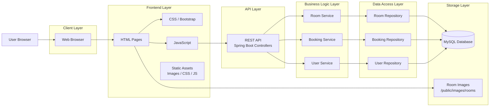
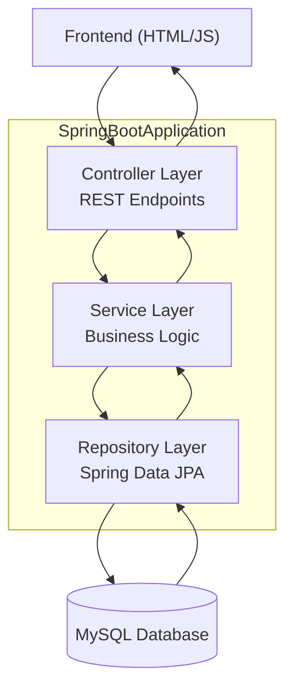
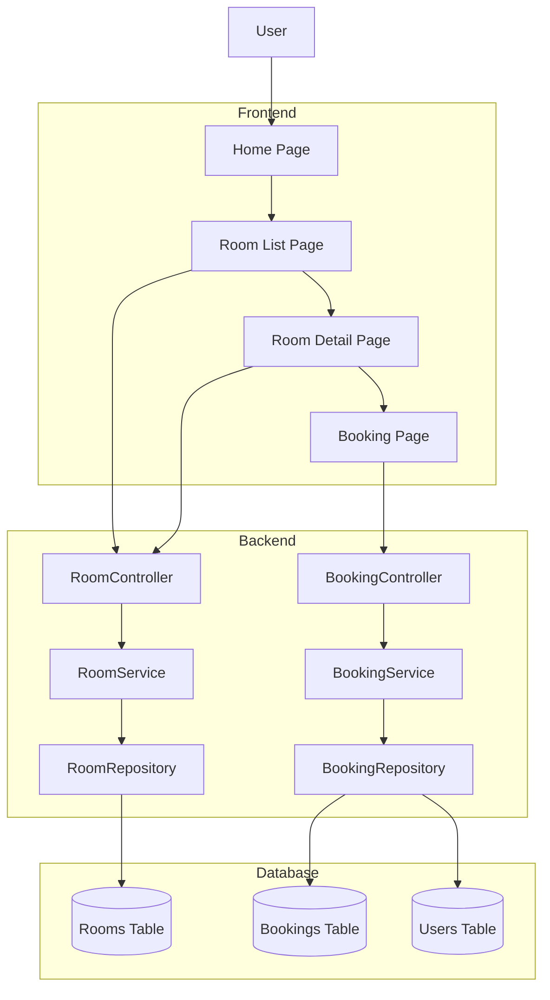
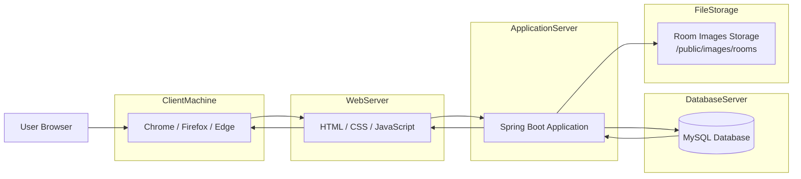
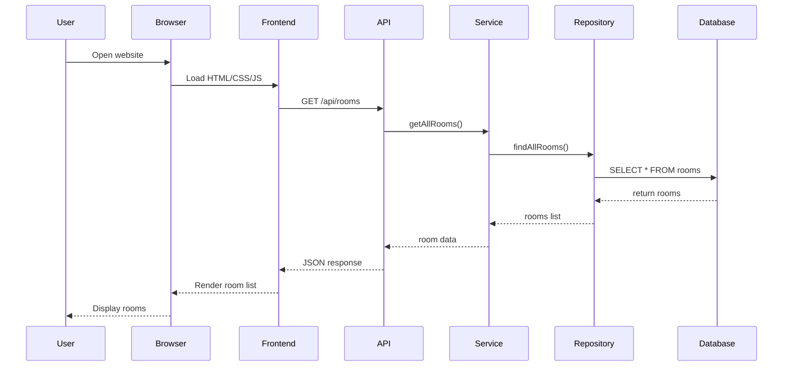
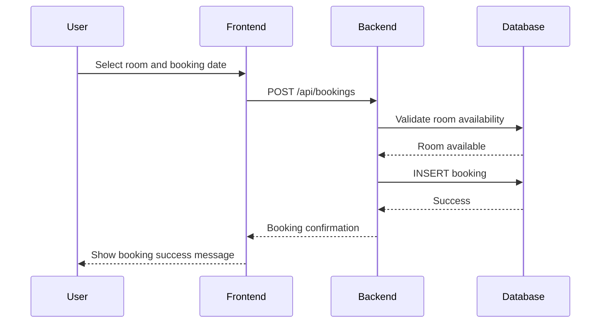

# System Architecture Diagram – Hotel Booking System

## 1. Overview

Architecture Diagram dưới đây mô tả chi tiết cách các thành phần của hệ thống **Hotel Booking System** tương tác với nhau.

Hệ thống được thiết kế theo kiến trúc **multi-layer architecture**, bao gồm:

- Client Layer
- Frontend Layer
- API Layer
- Business Logic Layer
- Data Access Layer
- Data Storage Layer

Kiến trúc này giúp hệ thống:

- dễ bảo trì
- dễ mở rộng
- tách biệt rõ ràng các thành phần

---

# 2. High Level System Architecture



---

# 3. Backend Internal Architecture

Backend sử dụng **Spring Boot Layered Architecture**.



---

# 4. Component Architecture

Sơ đồ dưới đây mô tả chi tiết các component chính trong hệ thống.



---

# 5. Deployment Architecture

Deployment diagram mô tả cách hệ thống được triển khai trong môi trường runtime.



---

# 6. Detailed Request Flow

Luồng xử lý request khi user truy cập danh sách phòng.



---

# 7. Booking Process Flow

Luồng đặt phòng của hệ thống.



---

# 8. Scalability Considerations

Trong tương lai, hệ thống có thể mở rộng thêm:

- Load Balancer
- API Gateway
- Microservices
- Cloud Storage cho ảnh
- Redis caching
- Authentication Server

Ví dụ kiến trúc mở rộng:

```
User
 ↓
Load Balancer
 ↓
Spring Boot API Cluster
 ↓
MySQL Cluster
```
