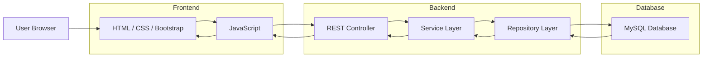
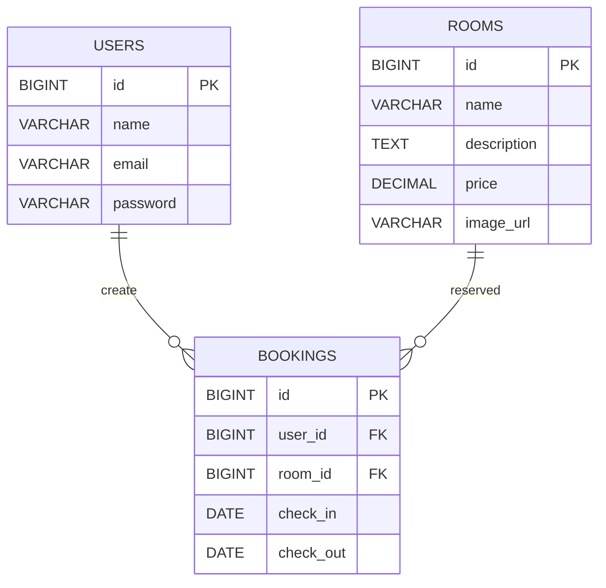
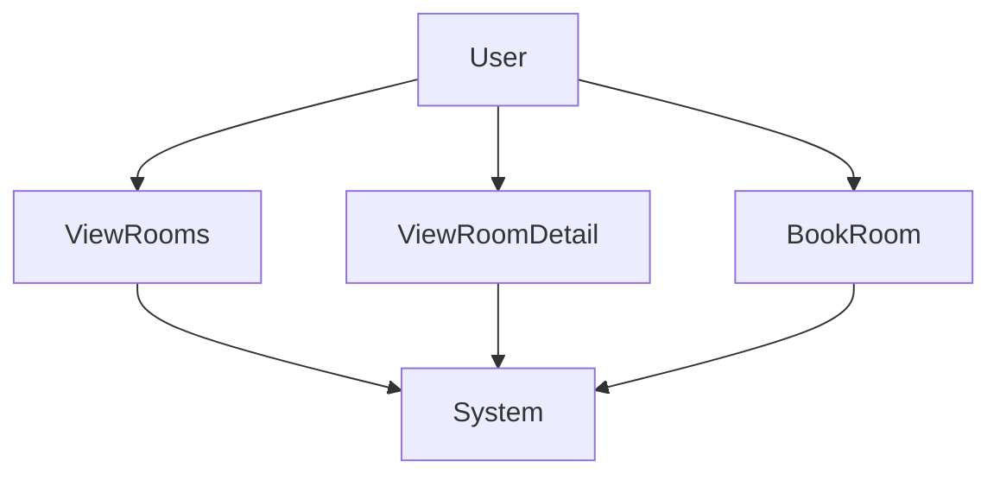
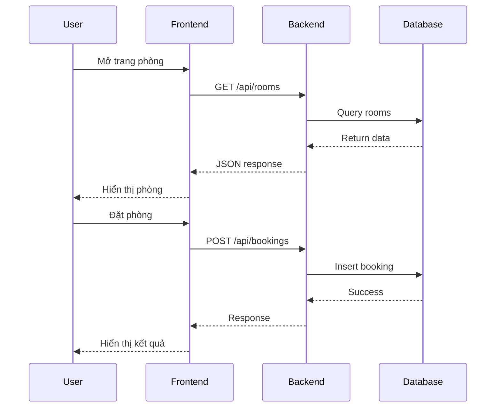

# TÀI LIỆU THIẾT KẾ HỆ THỐNG  
# HOTEL BOOKING SYSTEM

---

# 1. Giới thiệu

Tài liệu này mô tả chi tiết thiết kế hệ thống cho ứng dụng **Hotel Booking System**.  
Hệ thống được xây dựng nhằm cho phép người dùng truy cập website để xem thông tin phòng khách sạn và thực hiện đặt phòng trực tuyến.

Mục đích của tài liệu này:

- Mô tả kiến trúc tổng thể của hệ thống
- Giải thích các thành phần trong hệ thống
- Mô tả cấu trúc cơ sở dữ liệu
- Mô tả các API được sử dụng
- Trình bày luồng hoạt động của hệ thống
- Làm tài liệu tham khảo cho việc phát triển và bảo trì hệ thống

Hệ thống được xây dựng theo mô hình **Web Application** với kiến trúc tách biệt giữa giao diện người dùng, tầng xử lý logic và tầng lưu trữ dữ liệu.

---

# 2. Phạm vi hệ thống

Hệ thống hỗ trợ các chức năng chính sau:

- Hiển thị danh sách phòng khách sạn
- Hiển thị chi tiết phòng
- Cho phép người dùng thực hiện đặt phòng
- Lưu trữ thông tin đặt phòng
- Quản lý dữ liệu phòng trong cơ sở dữ liệu

Trong phiên bản hiện tại, hệ thống tập trung vào **chức năng hiển thị phòng và đặt phòng cơ bản**.

---

# 3. Công nghệ sử dụng

## 3.1 Frontend

Frontend được xây dựng bằng các công nghệ web cơ bản:

- HTML  
- CSS  
- Bootstrap  
- JavaScript  

Chức năng của frontend:

- Hiển thị giao diện người dùng
- Gửi request tới backend thông qua REST API
- Hiển thị dữ liệu trả về từ backend

---

## 3.2 Backend

Backend được phát triển bằng:

Spring Boot

Spring Boot được sử dụng để:

- xây dựng REST API
- xử lý logic nghiệp vụ
- kết nối database
- xử lý request và response

---

## 3.3 Database

Hệ thống sử dụng:

MySQL

MySQL được dùng để lưu trữ:

- thông tin phòng
- thông tin người dùng
- thông tin đặt phòng

---

## 3.4 Công cụ phát triển

Các công cụ hỗ trợ:

- Git
- Visual Studio Code
- Maven

---

# 4. Kiến trúc hệ thống

Hệ thống được thiết kế theo **Three Tier Architecture** gồm ba tầng chính:

1. Presentation Layer
2. Application Layer
3. Data Layer

---

## 4.1 Presentation Layer

Đây là tầng giao diện người dùng.

Tầng này có nhiệm vụ:

- hiển thị giao diện website
- cho phép người dùng tương tác
- gửi request đến backend

Công nghệ sử dụng:

HTML, CSS, Bootstrap, JavaScript

---

## 4.2 Application Layer

Đây là tầng xử lý logic nghiệp vụ của hệ thống.

Nhiệm vụ:

- nhận request từ frontend
- xử lý dữ liệu
- gọi repository để truy cập database
- trả response cho frontend

Công nghệ:

Spring Boot

---

## 4.3 Data Layer

Đây là tầng lưu trữ dữ liệu của hệ thống.

Chức năng:

- lưu trữ dữ liệu phòng
- lưu trữ dữ liệu booking
- lưu trữ dữ liệu người dùng

Công nghệ:

MySQL

---

# 5. Sơ đồ kiến trúc hệ thống



---

# 6. Kiến trúc backend

Backend sử dụng **Layered Architecture**.

Các tầng bao gồm:

- Controller
- Service
- Repository
- Database

```
Controller
   ↓
Service
   ↓
Repository
   ↓
Database
```

---

## 6.1 Controller

Controller chịu trách nhiệm:

- nhận request từ client
- gọi service
- trả response

Ví dụ endpoint:

```
GET /api/rooms
GET /api/rooms/{id}
POST /api/bookings
```

---

## 6.2 Service

Service chứa logic nghiệp vụ của hệ thống.

Ví dụ:

- xử lý booking
- kiểm tra dữ liệu hợp lệ
- xử lý logic hệ thống

---

## 6.3 Repository

Repository chịu trách nhiệm:

- truy vấn database
- lưu dữ liệu vào database

Sử dụng Spring Data JPA.

---

# 7. Cấu trúc project

```
hotel-booking-system

src/main/java/com/example/hotel

controller
    RoomController.java
    BookingController.java

service
    RoomService.java
    BookingService.java

repository
    RoomRepository.java
    BookingRepository.java

model
    Room.java
    Booking.java
    User.java

HotelBookingApplication.java
```

---

# 8. Thiết kế cơ sở dữ liệu

Hệ thống sử dụng ba bảng chính:

- USERS
- ROOMS
- BOOKINGS

---

## 8.1 Bảng USERS

| Column | Type | Mô tả |
|------|------|------|
| id | BIGINT | ID người dùng |
| name | VARCHAR | Tên |
| email | VARCHAR | Email |
| password | VARCHAR | Mật khẩu |

---

## 8.2 Bảng ROOMS

| Column | Type | Mô tả |
|------|------|------|
| id | BIGINT | ID phòng |
| name | VARCHAR | Tên phòng |
| description | TEXT | Mô tả |
| price | DECIMAL | Giá |
| image_url | VARCHAR | Đường dẫn ảnh |

---

## 8.3 Bảng BOOKINGS

| Column | Type | Mô tả |
|------|------|------|
| id | BIGINT | ID booking |
| user_id | BIGINT | ID user |
| room_id | BIGINT | ID room |
| check_in | DATE | Ngày nhận phòng |
| check_out | DATE | Ngày trả phòng |

---

# 9. ERD Diagram



---

# 10. Use Case Diagram



---

# 11. Luồng đặt phòng



---

# 12. Luồng dữ liệu hệ thống

1. Người dùng mở website
2. Frontend gửi request đến backend
3. Backend xử lý request
4. Backend truy vấn database
5. Database trả dữ liệu
6. Backend trả JSON response
7. Frontend hiển thị dữ liệu

---

# 13. Bảo mật

Các giải pháp bảo mật:

- kiểm tra dữ liệu đầu vào
- chống SQL injection
- mã hóa mật khẩu
- xác thực người dùng
- phân quyền truy cập

---

# 14. Hướng phát triển tương lai

Có thể mở rộng thêm:

- hệ thống đăng nhập
- trang admin quản lý phòng
- thanh toán online
- kiểm tra phòng trống
- email xác nhận booking

