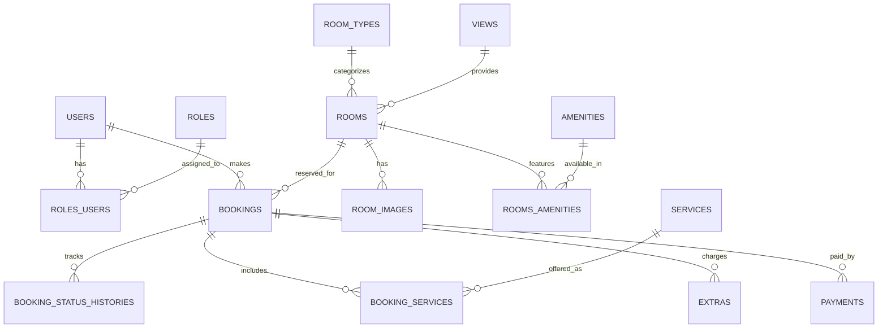
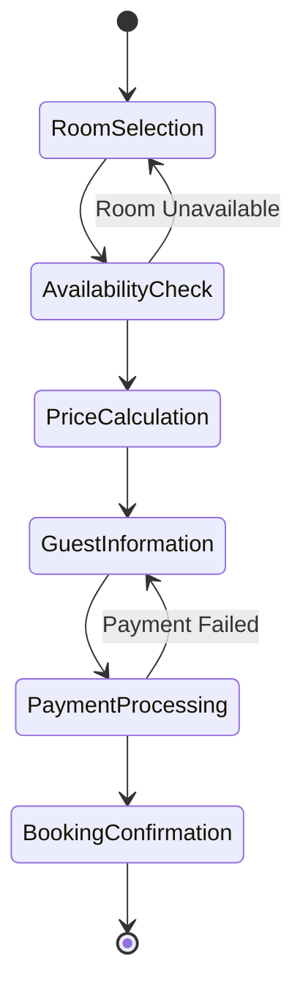
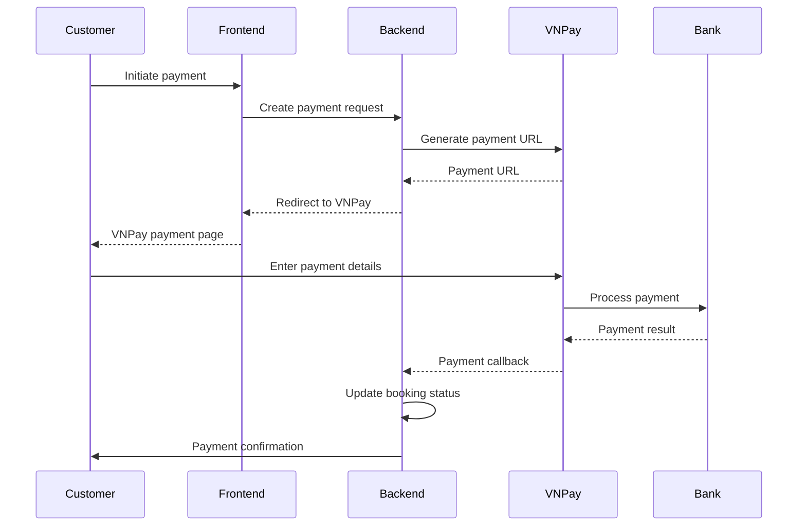

# Hotel Booking System - Design Document

## 1. Introduction

### 1.1 Purpose
This document provides a comprehensive design specification for the Hotel Booking System, a full-featured web application that enables customers to browse hotel rooms, make reservations, and manage bookings, while providing administrative tools for hotel staff to manage operations.

### 1.2 Scope
The system supports the following core functionalities:
- **Customer Portal**: Room browsing, booking, account management, booking history
- **Admin Portal**: Complete system management, user management, analytics
- **Receptionist Portal**: Booking processing, check-in/check-out operations
- **Authentication & Security**: JWT-based authentication with role-based access control
- **Payment Integration**: VNPay payment gateway integration
- **AI Chatbot**: Customer support automation
- **Image Management**: Cloudinary integration for room photos
- **Email Notifications**: Automated booking confirmations and updates

### 1.3 System Overview
The Hotel Booking System is built as a modern web application with:
- **Three Frontend Applications**: Separate interfaces for customers, administrators, and receptionists
- **Spring Boot Backend**: RESTful API with comprehensive business logic
- **MySQL Database**: Relational database with 15+ tables
- **External Integrations**: Payment processing, email service, AI chatbot, cloud storage

---

## 2. System Architecture

### 2.1 High-Level Architecture

```
┌─────────────────────────────────────────────────────────────┐
│                    Frontend Applications                    │
│  ┌─────────────────┐  ┌─────────────────┐  ┌─────────────┐  │
│  │  Customer UI    │  │   Admin UI      │  │Receptionist │  │
│  │  (FE_EndUser)   │  │   (FE_Admin)    │  │   UI        │  │
│  │                 │  │                 │  │(FE_Reception│  │
│  │ - Room browsing │  │ - System mgmt  │  │  ist)       │  │
│  │ - Booking       │  │ - Analytics    │  │             │  │
│  │ - Account mgmt  │  │ - User mgmt    │  │ - Check-in   │  │
│  └─────────────────┘  └─────────────────┘  └─────────────┘  │
└─────────────────────────────────────────────────────────────┘
                                │
┌─────────────────────────────────────────────────────────────┐
│                     Backend API Layer                       │
│  ┌─────────────────┐  ┌─────────────────┐  ┌─────────────┐  │
│  │ Authentication  │  │   Business      │  │  External   │  │
│  │   & Security    │  │   Services      │  │Integrations │  │
│  │                 │  │                 │  │             │  │
│  │ - JWT Auth      │  │ - Room Service  │  │ - VNPay     │  │
│  │ - Role-based    │  │ - Booking Svc   │  │ - Email     │  │
│  │ - OAuth2        │  │ - User Service  │  │ - Cloudinary│  │
│  └─────────────────┘  └─────────────────┘  └─────────────┘  │
└─────────────────────────────────────────────────────────────┘
                                │
┌─────────────────────────────────────────────────────────────┐
│                     Data Storage Layer                      │
│  ┌─────────────────┐  ┌─────────────────┐  ┌─────────────┐  │
│  │   MySQL         │  │   Cloudinary    │  │   Redis     │  │
│  │   Database      │  │   (Images)      │  │  (Cache)    │  │
│  │                 │  │                 │  │             │  │
│  │ - 15+ Tables    │  │ - Room photos   │  │ - Sessions  │  │
│  │ - Relations     │  │ - User uploads  │  │ - Temp data │  │
│  │ - Constraints   │  │                 │  │             │  │
│  └─────────────────┘  └─────────────────┘  └─────────────┘  │
└─────────────────────────────────────────────────────────────┘
```

### 2.2 Technology Stack

#### Backend Technologies
- **Framework**: Spring Boot 4.0.3
- **Java Version**: OpenJDK 21
- **Database**: MySQL 8.0+ with JPA/Hibernate
- **Security**: Spring Security with JWT and OAuth2
- **Build Tool**: Maven 3.9+
- **Mapping**: MapStruct for DTO conversions
- **Validation**: Bean Validation (JSR-303)
- **Documentation**: SpringDoc OpenAPI

#### Frontend Technologies
- **HTML5/CSS3**: Semantic markup and responsive design
- **Bootstrap 5**: UI framework for consistent styling
- **Vanilla JavaScript**: DOM manipulation and API calls
- **Chart.js**: Data visualization for admin dashboard
- **ApexCharts**: Advanced charts for analytics

#### External Services & Integrations
- **Payment**: VNPay payment gateway
- **Email**: Spring Boot Mail (SMTP)
- **AI Chatbot**: Spring AI with OpenAI API
- **Image Storage**: Cloudinary CDN
- **Authentication**: JWT tokens with refresh mechanism

#### Development & Deployment
- **Version Control**: Git
- **IDE**: Visual Studio Code
- **Containerization**: Docker
- **CI/CD**: Maven build pipeline

---

## 3. Database Design

### 3.1 Database Schema Overview

The system uses MySQL with 15+ tables implementing a comprehensive hotel management data model:

```
hotel_booking_system (Database)
├── Core Entities
│   ├── users (User accounts)
│   ├── roles (User roles)
│   ├── roles_users (User-Role relationships)
│   ├── rooms (Room inventory)
│   ├── room_types (Room categories)
│   ├── views (Room views)
│   ├── amenities (Room features)
│   ├── rooms_amenities (Room-Amenity relationships)
│   └── room_images (Room photos)
├── Booking System
│   ├── bookings (Reservations)
│   ├── booking_status_histories (Status changes)
│   ├── booking_services (Additional services)
│   └── extras (Extra charges)
├── Business Rules
│   ├── price_rules (Dynamic pricing)
│   ├── services (Hotel services)
│   └── payments (Payment records)
└── Security
    └── invalidated_tokens (JWT blacklist)
```

### 3.2 Key Entity Relationships



### 3.3 Detailed Table Specifications

#### Users Table
| Column | Type | Constraints | Description |
|--------|------|-------------|-------------|
| user_id | CHAR(36) | PK, UUID | Unique user identifier |
| username | VARCHAR(50) | NOT NULL, UNIQUE | Login username |
| password | VARCHAR(255) | NOT NULL | BCrypt hashed password |
| first_name | VARCHAR(100) | NOT NULL | User's first name |
| last_name | VARCHAR(100) | NOT NULL | User's last name |
| gender | VARCHAR(20) | NOT NULL, DEFAULT 'OTHER' | User gender |
| email | VARCHAR(100) | NOT NULL, UNIQUE | Email address |
| phone | VARCHAR(20) | NOT NULL | Phone number |
| user_status | VARCHAR(20) | NOT NULL, DEFAULT 'ACTIVE' | Account status |
| created_at | TIMESTAMP | NOT NULL, DEFAULT CURRENT_TIMESTAMP | Registration date |
| deleted_at | TIMESTAMP | NULL | Soft delete timestamp |

#### Rooms Table
| Column | Type | Constraints | Description |
|--------|------|-------------|-------------|
| room_id | CHAR(36) | PK, UUID | Unique room identifier |
| room_name | VARCHAR(255) | NOT NULL | Display name |
| room_number | VARCHAR(10) | NOT NULL, UNIQUE | Physical room number |
| floor | INTEGER | NOT NULL | Floor number |
| base_price | DECIMAL(12,2) | NOT NULL | Base nightly rate |
| max_adults | INTEGER | NOT NULL | Maximum adults |
| max_children | INTEGER | NOT NULL | Maximum children |
| area | DECIMAL(6,2) | NOT NULL | Room area in m² |
| description | TEXT | NULL | Room description |
| room_status | VARCHAR(20) | NOT NULL, DEFAULT 'AVAILABLE' | Availability status |
| deleted_at | TIMESTAMP | NULL | Soft delete timestamp |
| room_type_id | CHAR(36) | FK, NOT NULL | Room type reference |
| view_id | CHAR(36) | FK, NOT NULL | View reference |

#### Bookings Table
| Column | Type | Constraints | Description |
|--------|------|-------------|-------------|
| booking_id | CHAR(36) | PK, UUID | Unique booking identifier |
| booking_code | VARCHAR(50) | NOT NULL, UNIQUE | Human-readable code |
| check_in_date | DATE | NOT NULL | Check-in date |
| check_out_date | DATE | NOT NULL | Check-out date |
| guest_name | VARCHAR(200) | NOT NULL | Guest full name |
| guest_phone | VARCHAR(20) | NOT NULL | Guest phone |
| guest_email | VARCHAR(100) | NOT NULL | Guest email |
| identity_card | VARCHAR(20) | NULL | ID card number |
| adults | INTEGER | NOT NULL | Number of adults |
| children | INTEGER | NOT NULL | Number of children |
| note | VARCHAR(255) | NULL | Special requests |
| room_price | DECIMAL(12,2) | NOT NULL | Calculated room price |
| total_price | DECIMAL(12,2) | NOT NULL | Total booking price |
| created_at | TIMESTAMP | NOT NULL, DEFAULT CURRENT_TIMESTAMP | Booking creation time |
| booking_status | VARCHAR(20) | NOT NULL, DEFAULT 'PENDING' | Current status |
| payment_method | VARCHAR(20) | NOT NULL | Payment method |
| payment_status | VARCHAR(20) | NOT NULL | Payment status |
| paid_at | TIMESTAMP | NULL | Payment timestamp |
| user_id | CHAR(36) | FK, NULL | Customer reference |
| room_id | CHAR(36) | FK, NOT NULL | Room reference |

### 3.4 Data Constraints & Business Rules

#### Check Constraints
- Room prices must be positive
- Booking dates must be valid (check_out > check_in)
- Guest counts must be reasonable (adults >= 1, children >= 0)
- Room capacity validations

#### Business Rules
- Soft deletes for data preservation
- Unique constraints on critical fields
- Foreign key relationships with cascade operations
- Audit trails for status changes

---

## 4. Backend Architecture

### 4.1 Application Structure

```
src/main/java/com/hotel_booking_system/
├── config/                 # Configuration classes
│   ├── CloudinaryConfig.java
│   ├── CorsConfig.java
│   ├── OpenApiConfig.java
│   ├── SecurityConfig.java
│   └── VNPayConfig.java
├── controller/             # REST API endpoints
│   ├── AuthenticationController.java
│   ├── BookingController.java
│   ├── RoomController.java
│   ├── UserController.java
│   └── ...
├── dto/                    # Data Transfer Objects
│   ├── request/            # Request DTOs
│   └── response/           # Response DTOs
├── entity/                 # JPA Entities
│   ├── User.java
│   ├── Room.java
│   ├── Booking.java
│   └── ...
├── enums/                  # Enumeration classes
│   ├── BookingStatus.java
│   ├── RoleName.java
│   └── ...
├── exception/              # Custom exceptions
├── mapper/                 # MapStruct mappers
├── repository/             # Data access layer
├── service/                # Business logic layer
├── util/                   # Utility classes
└── HotelBookingSystemApplication.java
```

### 4.2 Layered Architecture Pattern

```
┌─────────────────────────────────────┐
│        Controller Layer             │
│  - REST API endpoints               │
│  - Request/Response handling        │
│  - Input validation                 │
│  - Authentication checks            │
└─────────────────────────────────────┘
                │
┌─────────────────────────────────────┐
│        Service Layer                │
│  - Business logic implementation    │
│  - Transaction management           │
│  - External service integration     │
│  - Data transformation              │
└─────────────────────────────────────┘
                │
┌─────────────────────────────────────┐
│      Repository Layer               │
│  - Data access abstraction          │
│  - Query execution                  │
│  - Entity management                │
└─────────────────────────────────────┘
                │
┌─────────────────────────────────────┐
│        Database Layer               │
│  - MySQL database                   │
│  - Entity relationships             │
│  - Data persistence                 │
└─────────────────────────────────────┘
```

### 4.3 Key Components

#### Controllers (15+ REST endpoints)
- **AuthenticationController**: Login, registration, token refresh
- **RoomController**: CRUD operations for rooms, search, filtering
- **BookingController**: Booking lifecycle management
- **UserController**: User management for admins
- **DashboardController**: Analytics and reporting
- **UploadController**: Image upload handling
- **VNPayController**: Payment processing
- **ChatbotController**: AI customer support

#### Services (Business Logic)
- **AuthenticationService**: JWT token management, user authentication
- **RoomService**: Room availability, pricing calculations
- **BookingService**: Booking workflow, status management
- **UserService**: User CRUD, role management
- **EmailService**: Notification sending
- **PaymentService**: VNPay integration
- **ChatbotService**: OpenAI integration

#### Repositories (Data Access)
- JPA repositories with custom queries
- Complex joins and aggregations
- Soft delete support
- Pagination and sorting

### 4.4 API Design

#### REST API Standards
- **HTTP Methods**: GET, POST, PUT, DELETE, PATCH
- **Status Codes**: Standard HTTP status codes
- **Content-Type**: application/json
- **Authentication**: Bearer token (JWT)

#### Response Format
```json
{
  "success": true,
  "message": "Operation completed successfully",
  "data": { ... },
  "timestamp": "2024-01-01T12:00:00Z",
  "pagination": { ... } // for list endpoints
}
```

#### Error Response Format
```json
{
  "success": false,
  "message": "Error description",
  "error": "ERROR_CODE",
  "timestamp": "2024-01-01T12:00:00Z",
  "details": { ... } // additional error information
}
```

#### Key API Endpoints

| Endpoint | Method | Description | Authentication |
|----------|--------|-------------|----------------|
| `/api/auth/login` | POST | User authentication | None |
| `/api/auth/register` | POST | User registration | None |
| `/api/rooms` | GET | List rooms with filtering | Optional |
| `/api/rooms/{id}` | GET | Get room details | Optional |
| `/api/bookings` | POST | Create booking | Customer |
| `/api/bookings/{id}` | PUT | Update booking | Owner/Admin |
| `/api/admin/users` | GET | List users | Admin |
| `/api/dashboard/stats` | GET | System statistics | Admin/Receptionist |

---

## 5. Frontend Architecture

### 5.1 Multi-Application Structure

The system consists of three separate frontend applications, each serving different user roles:

#### Customer Frontend (FE_EndUser)
**Purpose**: Public-facing website for hotel customers
**Pages**: 15+ HTML pages including:
- Home page with featured rooms
- Room listing and search
- Room details with image gallery
- Booking form and confirmation
- User account management
- Booking history
- AI chatbot integration

#### Admin Frontend (FE_Admin)
**Purpose**: Administrative control panel
**Pages**: 12+ HTML pages including:
- Dashboard with analytics
- Room management (CRUD)
- User management
- Booking oversight
- System configuration
- Reporting tools

#### Receptionist Frontend (FE_Receptionist)
**Purpose**: Front desk operations interface
**Pages**: 5+ HTML pages including:
- Booking management
- Check-in/check-out processing
- Guest services
- Payment handling

### 5.2 Frontend Technologies

#### HTML Structure
- Semantic HTML5 markup
- Responsive design with Bootstrap 5
- Accessible form elements
- SEO-friendly meta tags

#### CSS & Styling
- Bootstrap 5 framework
- Custom CSS for branding
- Responsive breakpoints
- Dark/light theme support

#### JavaScript Architecture
- Vanilla JavaScript (no frameworks)
- Modular code organization
- API integration layer
- Form validation
- Dynamic content loading

#### Key Features
- **Real-time Updates**: AJAX calls for dynamic content
- **Form Validation**: Client-side and server-side validation
- **Image Galleries**: Lightbox and carousel implementations
- **Charts & Analytics**: Chart.js and ApexCharts integration
- **Search & Filtering**: Advanced room search capabilities

---

## 6. Security Architecture

### 6.1 Authentication & Authorization

#### JWT-Based Authentication
- **Access Tokens**: Short-lived (15 minutes) for API access
- **Refresh Tokens**: Long-lived (7 days) for token renewal
- **Token Storage**: HTTP-only cookies for security
- **Token Blacklisting**: Invalidated tokens stored in database

#### Role-Based Access Control (RBAC)
- **ADMIN**: Full system access, user management, system configuration
- **RECEPTIONIST**: Booking management, check-in/check-out, guest services
- **CUSTOMER**: Personal bookings, account management, public content

#### OAuth2 Integration
- Social login support (Google, Facebook)
- Third-party authentication providers
- Secure token exchange

### 6.2 Security Measures

#### Data Protection
- **Password Hashing**: BCrypt with salt
- **Data Encryption**: Sensitive data encryption at rest
- **HTTPS Only**: SSL/TLS encryption in production
- **Input Sanitization**: XSS prevention, SQL injection protection

#### API Security
- **Rate Limiting**: Request throttling to prevent abuse
- **CORS Configuration**: Cross-origin resource sharing controls
- **CSRF Protection**: Cross-site request forgery prevention
- **Security Headers**: OWASP recommended headers

#### Session Management
- **Secure Cookies**: HttpOnly, Secure, SameSite flags
- **Session Timeout**: Automatic logout on inactivity
- **Concurrent Session Control**: Single session per user

---

## 7. Business Logic & Workflows

### 7.1 Booking Workflow



#### Detailed Booking Process
1. **Room Selection**: Customer browses and selects room with dates
2. **Availability Check**: System validates room availability for selected dates
3. **Price Calculation**:
   - Base room price × number of nights
   - Apply seasonal price rules (price_rules table)
   - Add selected services (booking_services)
   - Calculate taxes and fees
4. **Guest Information**: Collect guest details and special requests
5. **Payment Processing**: Integrate with VNPay gateway
6. **Booking Confirmation**: Generate booking code, send email confirmation
7. **Status Management**: Track booking lifecycle (PENDING → CONFIRMED → CHECKED_IN → CHECKED_OUT)

### 7.2 Price Calculation Logic

#### Base Price Calculation
```
total_room_price = base_price × number_of_nights × price_multiplier
```

#### Price Multipliers
- Seasonal adjustments from `price_rules` table
- Weekend/holiday surcharges
- Dynamic pricing based on demand

#### Additional Charges
- Hotel services (spa, meals, transportation)
- Extra guest charges
- Special requests or amenities

### 7.3 Availability Management

#### Room Status Values
- **AVAILABLE**: Room can be booked
- **OCCUPIED**: Currently occupied
- **MAINTENANCE**: Under maintenance
- **CLEANING**: Being cleaned between guests

#### Availability Algorithm
1. Check room status
2. Query existing bookings for date conflicts
3. Apply business rules (minimum stay, maximum advance booking)
4. Return availability status with pricing

---

## 8. Integration Architecture

### 8.1 Payment Integration (VNPay)

#### VNPay Integration Points
- **Payment Creation**: Generate payment URL with booking details
- **Payment Callback**: Handle payment success/failure notifications
- **Payment Verification**: Validate payment authenticity
- **Refund Processing**: Handle booking cancellations

#### Payment Flow


### 8.2 Email Integration

#### Email Service Features
- **Booking Confirmations**: Automated booking confirmation emails
- **Payment Receipts**: Payment confirmation with details
- **Status Updates**: Booking status change notifications
- **Marketing Emails**: Promotional content (future feature)

#### Email Templates
- HTML templates with booking details
- Responsive design for mobile devices
- Hotel branding and styling
- Multi-language support preparation

### 8.3 AI Chatbot Integration

#### Chatbot Capabilities
- **Customer Support**: Answer common questions
- **Room Information**: Provide room details and availability
- **Booking Assistance**: Help with booking process
- **General Inquiries**: Handle miscellaneous questions

#### OpenAI Integration
- **GPT Model**: Latest GPT model for natural language processing
- **Context Awareness**: Maintain conversation context
- **Hotel Knowledge**: Trained on hotel information and policies
- **Fallback Handling**: Escalate complex issues to human staff

### 8.4 Cloudinary Integration

#### Image Management
- **Room Photos**: High-quality room images with multiple angles
- **User Uploads**: Customer photo uploads for verification
- **Image Optimization**: Automatic resizing and format optimization
- **CDN Delivery**: Fast global image delivery

---

## 9. Deployment & DevOps

### 9.1 Development Environment

#### Local Development Setup
- **Java 21**: JDK installation and configuration
- **MySQL**: Local database instance
- **Maven**: Dependency management and builds
- **Git**: Version control
- **VS Code**: Development IDE with extensions

#### Development Workflow
1. Clone repository
2. Set up local database
3. Configure application properties
4. Run Maven clean install
5. Start Spring Boot application
6. Access frontend applications

### 9.2 Production Deployment

#### Infrastructure Requirements
- **Application Server**: Ubuntu 22.04 LTS or similar
- **Database Server**: MySQL 8.0+ with replication
- **Web Server**: Nginx for reverse proxy and static files
- **SSL Certificate**: Let's Encrypt or commercial SSL
- **Monitoring**: Application and server monitoring

#### Docker Configuration
```dockerfile
# Multi-stage Docker build
FROM maven:3.9-openjdk-21 AS build
# Build JAR file

FROM openjdk:21-jre-slim
# Run application
EXPOSE 8080
```

#### Environment Configuration
- **Application Properties**: Environment-specific configurations
- **Database Connection**: Production database credentials
- **External API Keys**: VNPay, Cloudinary, OpenAI keys
- **Email Configuration**: SMTP server settings

### 9.3 Monitoring & Maintenance

#### Application Monitoring
- **Health Checks**: Spring Boot Actuator endpoints
- **Metrics Collection**: Application performance metrics
- **Error Tracking**: Centralized error logging
- **Performance Monitoring**: Response times and throughput

#### Database Maintenance
- **Backup Strategy**: Automated daily backups
- **Performance Tuning**: Query optimization and indexing
- **Data Archiving**: Old booking data archiving
- **Replication**: Master-slave replication for high availability

---

## 10. Performance & Scalability

### 10.1 Database Optimization

#### Indexing Strategy
- Primary keys on all tables
- Foreign key indexes
- Composite indexes for common queries
- Full-text search indexes for room descriptions

#### Query Optimization
- Efficient JOIN operations
- Pagination for large result sets
- Query result caching
- Database connection pooling

### 10.2 Application Performance

#### Caching Strategy
- **Redis**: Session storage and temporary data
- **Application Cache**: Frequently accessed data
- **CDN**: Static asset delivery
- **Database Query Cache**: JPA second-level cache

#### Asynchronous Processing
- **Email Sending**: Asynchronous email delivery
- **Image Processing**: Background image optimization
- **Report Generation**: Scheduled report creation

### 10.3 Scalability Considerations

#### Horizontal Scaling
- **Application Servers**: Multiple instances behind load balancer
- **Database**: Read replicas for query distribution
- **File Storage**: Cloudinary CDN for global distribution

#### Microservices Preparation
- Modular service architecture
- API gateway pattern
- Service discovery
- Event-driven communication

---

## 11. Testing Strategy

### 11.1 Testing Levels

#### Unit Testing
- **Service Layer**: Business logic testing with Mockito
- **Repository Layer**: Data access testing
- **Utility Classes**: Helper function testing
- **Validation**: Input validation testing

#### Integration Testing
- **API Endpoints**: REST API testing with TestRestTemplate
- **Database Integration**: Repository testing with test database
- **External Services**: Mock external API calls

#### End-to-End Testing
- **User Workflows**: Complete booking process testing
- **Cross-browser Testing**: Frontend compatibility testing
- **Performance Testing**: Load testing with JMeter

### 11.2 Testing Tools & Frameworks

#### Backend Testing
- **JUnit 5**: Unit and integration testing
- **Mockito**: Mocking framework
- **Testcontainers**: Database integration testing
- **Spring Boot Test**: Application context testing

#### Frontend Testing
- **Manual Testing**: User acceptance testing
- **Cross-browser Testing**: Browser compatibility
- **API Testing**: Postman collections for API testing

---

## 12. Future Enhancements

### 12.1 Planned Features

#### Phase 2 Features
- **Mobile Application**: React Native mobile app
- **Multi-language Support**: Internationalization (i18n)
- **Advanced Analytics**: Business intelligence dashboard
- **Loyalty Program**: Customer rewards system

#### Phase 3 Features
- **Channel Manager Integration**: OTA connectivity (Booking.com, Expedia)
- **PMS Integration**: Property management system integration
- **Dynamic Pricing**: AI-based price optimization
- **Voice Booking**: Alexa/Google Home integration

### 12.2 Technical Improvements

#### Architecture Evolution
- **Microservices Migration**: Break down monolithic application
- **GraphQL API**: More flexible API design
- **Event Sourcing**: Event-driven architecture
- **CQRS Pattern**: Command Query Responsibility Segregation

#### Performance Enhancements
- **Kubernetes**: Container orchestration
- **Service Mesh**: Istio for microservices communication
- **Advanced Caching**: Multi-level caching strategy
- **CDN Integration**: Global content delivery

---

## 13. Conclusion

The Hotel Booking System represents a comprehensive, enterprise-grade solution for hotel operations management. Built with modern technologies and following industry best practices, the system provides:

### Key Achievements
- **Scalable Architecture**: Three-tier design with clear separation of concerns
- **Comprehensive Features**: Full booking lifecycle management
- **Security First**: Robust authentication and authorization
- **Integration Ready**: Payment, email, AI, and cloud storage integrations
- **Multi-role Support**: Separate interfaces for different user types
- **Modern Tech Stack**: Spring Boot 4.0.3, Java 21, MySQL, and more

### Business Value
- **Operational Efficiency**: Streamlined hotel operations
- **Customer Experience**: Intuitive booking process with AI support
- **Revenue Optimization**: Dynamic pricing and service add-ons
- **Data-driven Decisions**: Comprehensive analytics and reporting
- **Scalability**: Support for hotel chain expansion

### Technical Excellence
- **Clean Architecture**: Layered design with proper abstractions
- **Code Quality**: Comprehensive testing and documentation
- **Performance**: Optimized for high-traffic scenarios
- **Maintainability**: Modular design for easy updates
- **Security**: Industry-standard security practices

The system is production-ready and designed for long-term growth and evolution in the hospitality industry.
