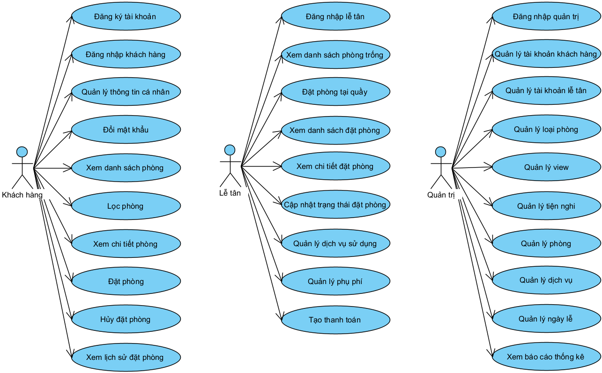

# **TÀI LIỆU ĐẶC TẢ YÊU CẦU PHẦN MỀM**

# *XÂY DỰNG HỆ THỐNG ĐẶT PHÒNG KHÁCH SẠN*

# 1. Giới thiệu

## 1.1. Tổng quan

Tài liệu này được viết dựa theo chuẩn của Tài liệu đặc tả yêu cầu phần mềm (Software Requirements Specifications - SRS) được giải thích trong *"IEEE Recommended Practice for Software Requirements Specifications"* và *"IEEE Guide for Developing System Requirements Specifications"*.

Cấu trúc tài liệu được chia làm bốn phần:
1. Giới thiệu.
2. Mô tả tổng quan.
3. Các yêu cầu chức năng.
4. Các yêu cầu phi chức năng.

## 1.2. Mục đích

Mục đích của tài liệu đặc tả yêu cầu phần mềm này là cung cấp một cái nhìn tổng quan, dễ hiểu về các yêu cầu và thành phần của dự án.

Tài liệu này được cung cấp như một tài liệu tham khảo cho người trực tiếp tham gia phát triển dự án. Ngoài ra, trong môi trường thực tế bên ngoài, tài liệu này còn phục vụ cho những nhà phát triển phần mềm, kiểm thử viên, nhà quản lý dự án cũng như các bên liên quan.

## 1.3. Phạm vi

Tài liệu đặc tả yêu cầu phần mềm này được xây dựng nhằm phục vụ cho dự án ***Xây dựng Hệ thống đặt phòng khách sạn***.

# 2. Mô tả tổng quan

## 2.1. Tổng quan sản phẩm

Hệ thống đặt phòng khách sạn được xây dựng nhằm phục vụ ba nhóm người dùng chính gồm khách hàng, nhân viên lễ tân và quản trị viên, mỗi nhóm có các chức năng riêng biệt phù hợp với vai trò của mình. Đối với khách hàng, hệ thống hỗ trợ đăng ký tài khoản, đăng nhập, quản lý thông tin cá nhân, đổi mật khẩu, xem danh sách phòng, lọc phòng theo nhu cầu, xem chi tiết phòng, thực hiện đặt phòng, hủy đặt phòng và theo dõi lịch sử đặt phòng. Những chức năng này giúp khách hàng dễ dàng tìm kiếm và đặt phòng trực tuyến một cách nhanh chóng và thuận tiện.

Đối với nhân viên lễ tân, hệ thống cung cấp các chức năng đăng nhập, xem danh sách phòng trống, hỗ trợ đặt phòng cho khách, quản lý danh sách đặt phòng, cập nhật trạng thái đặt phòng như xác nhận, check-in, check-out hoặc hủy đặt phòng, đồng thời thực hiện tạo thông tin thanh toán. Các chức năng này giúp lễ tân quản lý hoạt động đặt phòng tại khách sạn một cách hiệu quả và chính xác.

Đối với quản trị viên, hệ thống cung cấp quyền quản lý toàn bộ hệ thống bao gồm quản lý tài khoản khách hàng và lễ tân (xem, thêm, sửa, khóa/mở, cấp lại mật khẩu), quản lý các danh mục như loại phòng, view, tiện nghi, phòng và dịch vụ. Ngoài ra, quản trị viên còn có chức năng theo dõi và xem các báo cáo thống kê nhằm hỗ trợ việc đánh giá hiệu quả hoạt động và đưa ra quyết định quản lý phù hợp.

Tổng thể, hệ thống được thiết kế theo mô hình phân quyền rõ ràng, đảm bảo tính bảo mật, dễ sử dụng và tối ưu hóa quy trình quản lý đặt phòng khách sạn.

## 2.2. Các tác nhân

1. Khách hàng
2. Lễ tân
3. Quản trị

## 2.3. Các chức năng của sản phẩm

### Khách hàng:
- Đăng ký tài khoản.
- Đăng nhập.
- Quản lý thông tin cá nhân.
- Đổi mật khẩu.
- Xem danh sách phòng.
- Lọc phòng.
- Xem chi tiết phòng.
- Đặt phòng.
- Hủy đặt phòng.
- Xem lịch sử đặt phòng.

### Nhân viên lễ tân:
- Đăng nhập.
- Xem danh sách phòng trống.
- Đặt phòng.
- Xem danh sách đặt phòng.
- Cập nhật trạng thái đặt phòng (xác nhận, check-in, check-out, hủy).
- Tạo thanh toán.

### Quản trị viên:
- Đăng nhập.
- Quản lý tài khoản khách hàng (xem, khóa/mở).
- Quản lý tài khoản lễ tân (xem, thêm, sửa, cấp lại mật khẩu, xóa, khóa/mở).
- Quản lý loại phòng (xem, thêm, sửa, xóa).
- Quản lý view (xem, thêm sửa, xóa).
- Quản lý tiện nghi (xem, thêm sửa, xóa).
- Quản lý phòng (xem, thêm, sửa, xóa).
- Quản lý dịch vụ (xem, thêm sửa, xóa).
- Xem báo cáo thống kê.

## 2.4. Biểu đồ use case tổng quan

# 3. Các yêu cầu chức năng

## 3.1. Đặc tả use case Đăng ký tài khoản

### 1. Tên Use Case
Đăng ký tài khoản.
### 2. Mô tả vắn tắt
Use case này cho phép khách hàng đăng ký tài khoản mới.
### 3. Luồng các sự kiện
#### 3.1. Luồng cơ bản
1. Use case này bắt đầu khi khách hàng nhấn nút “Đăng ký” trên thanh menu. Hệ thống hiển thị màn hình yêu cầu nhập các thông tin: họ, tên, giới tính, email, số điện thoại, tên đăng nhập, mật khẩu.
2. Khách hàng nhập đầy đủ các thông tin và nhấn nút “Đăng ký”. Hệ thống kiểm tra dữ liệu nhập vào, nếu hợp lệ sẽ lưu thông tin vào bảng USERS trong cơ sở dữ liệu và hiển thị thông báo “Đăng ký tài khoản thành công”.
3. Use case kết thúc.
#### 3.2. Các luồng rẽ nhánh
1. Tại bước 2 trong luồng cơ bản, nếu bỏ trống bất kỳ thông tin nào, hệ thống hiển thị thông báo “Vui lòng nhập đầy đủ thông tin”.
2. Tại bước 2 trong luồng cơ bản, nếu tên đăng nhập đã tồn tại, hệ thống hiển thị thông báo “Tên đăng nhập đã tồn tại”.
3. Tại bước 2 trong luồng cơ bản, nếu email đã tồn tại, hệ thống hiển thị thông báo “Email đã tồn tại”.
4. Tại bước 2 trong luồng cơ bản, nếu mật khẩu không nằm trong khoảng 8 đến 50 ký tự, hệ thống hiển thị thông báo “Mật khẩu không hợp lệ”.
5. Tại bất kỳ thời điểm nào trong quá trình thực hiện use case, nếu không kết nối được với cơ sở dữ liệu, hệ thống hiển thị thông báo “Lỗi kết nối”. Use case kết thúc.
### 4. Các yêu cầu đặc biệt
Không có.
### 5. Tiền điều kiện
Không có.
### 6. Hậu điều kiện
Nếu use case kết thúc thành công, dữ liệu sẽ được cập nhật trong cơ sở dữ liệu.
### 7. Điểm mở rộng
Không có.

## 3.2. Đặc tả use case Đăng nhập

### 1. Tên Use Case
Đăng nhập.
### 2. Mô tả vắn tắt
Use case này cho phép người dùng đăng nhập vào hệ thống.
### 3. Luồng các sự kiện
#### 3.1. Luồng cơ bản
1. Use case này bắt đầu khi người dùng nhấn nút “Đăng nhập” trên thanh menu. Hệ thống hiển thị màn hình yêu cầu nhập các thông tin: tên đăng nhập, mật khẩu
2. Người dùng nhập đầy đủ các thông tin và nhấn nút “Đăng nhập”. Hệ thống kiểm tra dữ liệu nhập vào, nếu hợp lệ sẽ xác thực người dùng trong bảng USERS sau đó hiển thị thông báo “Đăng nhập thành công” và chuyển đến trang tương ứng với quyền.
3. Use case kết thúc.
#### 3.2. Các luồng rẽ nhánh
1. Tại bước 2 trong luồng cơ bản, nếu bỏ trống bất kỳ thông tin nào, hệ thống hiển thị thông báo “Vui lòng nhập đầy đủ thông tin”.
2. Tại bước 2 trong luồng cơ bản, nếu sai tên đăng nhập hoặc mật khẩu, hệ thống hiển thị thông báo “Sai tên đăng nhập hoặc mật khẩu”.
3. Tại bất kỳ thời điểm nào trong quá trình thực hiện use case, nếu không kết nối được với cơ sở dữ liệu, hệ thống hiển thị thông báo “Lỗi kết nối”. Use case kết thúc.
### 4. Các yêu cầu đặc biệt
Không có.
### 5. Tiền điều kiện
Không có.
### 6. Hậu điều kiện
Nếu đăng nhập thành công, người dùng sẽ được chuyển hướng đến giao diện tương ứng với quyền của mình.
### 7. Điểm mở rộng
Không có.

## 3.3. Đặc tả use case Quản lý thông tin cá nhân

### 1. Tên Use Case
Quản lý thông tin cá nhân.
### 2. Mô tả vắn tắt
Use case này cho phép khách hàng xem và sửa thông tin cá nhân.
### 3. Luồng các sự kiện
#### 3.1. Luồng cơ bản
1. Use case này bắt đầu khi khách hàng nhấn nút “Tài khoản” trên thanh menu. Hệ thống lấy dữ liệu từ bảng USERS và hiển thị lên màn hình các thông tin: họ, tên, giới tính, email, số điện thoại.
2. Khách hàng thay đổi thông tin và nhấn nút “Lưu thay đổi”. Hệ thống kiểm tra dữ liệu nhập vào, nếu hợp lệ sẽ cập nhật thay đổi vào bảng USERS trong cơ sở dữ liệu và hiển thị thông báo “Cập nhật thông tin thành công”.
3. Use case kết thúc.
#### 3.2. Các luồng rẽ nhánh
1. Tại bước 2 trong luồng cơ bản, nếu bỏ trống thông tin, hệ thống hiển thị thông báo “Vui lòng nhập đầy đủ thông tin”.
2. Tại bước 2 trong luồng cơ bản, nếu email đã tồn tại, hệ thống hiển thị thông báo “Email đã tồn tại”.
3. Tại bất kỳ thời điểm nào trong quá trình thực hiện use case, nếu không kết nối được với cơ sở dữ liệu, hệ thống hiển thị thông báo “Lỗi kết nối”. Use case kết thúc.
### 4. Các yêu cầu đặc biệt
Không có.
### 5. Tiền điều kiện
Khách hàng cần đăng nhập vào hệ thống với vai trò khách hàng trước khi thực hiện use case
### 6. Hậu điều kiện
Nếu use case kết thúc thành công, dữ liệu sẽ được cập nhật trong cơ sở dữ liệu.
### 7. Điểm mở rộng
Không có.

## 3.4. Đặc tả use case Đổi mật khẩu

### 1. Tên Use Case
Đổi mật khẩu.
### 2. Mô tả vắn tắt
Use case này cho phép khách hàng đổi mật khẩu tài khoản khách hàng.
### 3. Luồng các sự kiện
#### 3.1. Luồng cơ bản
1. Use case này bắt đầu khi khách hàng nhấn nút “Tài khoản” trên thanh menu. Hệ thống hiển thị form nhập: mật khẩu hiện tại, mật khẩu mới, nhập lại mật khẩu mới.
2. Khách hàng nhập đầy đủ thông tin và nhấn nút “Lưu thay đổi”. Hệ thống kiểm tra dữ liệu nhập vào, nếu hợp lệ sẽ cập nhật thông tin vào bảng USERS trong cơ sở dữ liệu và hiển thị thông báo “Cập nhật mật khẩu thành công”.
3. Use case kết thúc.
#### 3.2. Các luồng rẽ nhánh
1. Tại bước 2 trong luồng cơ bản, nếu bỏ trống bất kỳ thông tin nào, hệ thống hiển thị thông báo “Vui lòng nhập đầy đủ thông tin”.
2. Tại bước 2 trong luồng cơ bản, nếu mật khẩu mới không nằm trong khoảng 8 đến 50 ký tự, hệ thống hiển thị thông báo “Mật khẩu mới không hợp lệ”.
3. Tại bước 2 trong luồng cơ bản, nếu nhập lại mật khẩu mới không khớp, hệ thống hiển thị thông báo “Mật khẩu mới nhập lại không khớp”.
4. Tại bước 2 trong luồng cơ bản, nếu mật khẩu hiện tại không đúng, hệ thống hiển thị thông báo “Mật khẩu hiện tại không chính xác”.
5. Tại bất kỳ thời điểm nào trong quá trình thực hiện use case, nếu không kết nối được với cơ sở dữ liệu, hệ thống hiển thị thông báo “Lỗi kết nối”. Use case kết thúc.
### 4. Các yêu cầu đặc biệt
Không có.
### 5. Tiền điều kiện
Khách hàng cần đăng nhập vào hệ thống với vai trò khách hàng trước khi thực hiện use case
### 6. Hậu điều kiện
Nếu use case kết thúc thành công, dữ liệu sẽ được cập nhật trong cơ sở dữ liệu.
### 7. Điểm mở rộng
Không có.

## 3.5. Đặc tả use case Xem danh sách phòng

### 1. Tên Use Case
Xem danh sách phòng.
### 2. Mô tả vắn tắt
Use case này cho phép khách hàng xem danh sách các phòng.
### 3. Luồng các sự kiện
#### 3.1. Luồng cơ bản
1. Use case này bắt đầu khi khách hàng nhấn nút “Phòng” trên thanh menu. Hệ thống lấy dữ liệu từ bảng ROOMS, ROOM_IMAGES và hiển thị lên màn hình danh sách các phòng với các thông tin: ảnh phòng, tên phòng, tầng, số trẻ em tối đa, số người lớn tối đa, diện tích, mô tả, giá
2. Use case kết thúc.
#### 3.2. Các luồng rẽ nhánh
1. Tại bất kỳ thời điểm nào trong quá trình thực hiện use case, nếu không kết nối được với cơ sở dữ liệu, hệ thống hiển thị thông báo “Lỗi kết nối”. Use case kết thúc
### 4. Các yêu cầu đặc biệt
Không có.
### 5. Tiền điều kiện
Không có.
### 6. Hậu điều kiện
Không có.
### 7. Điểm mở rộng
Không có.

## 3.6. Đặc tả use case Lọc phòng

### 1. Tên Use Case
Lọc phòng.
### 2. Mô tả vắn tắt
Use case này cho phép khách hàng lọc ra các phòng theo các tiêu chí.
### 3. Luồng các sự kiện
#### 3.1. Luồng cơ bản
1. Use case này bắt đầu khi khách hàng nhập (ngày nhận phòng, ngày trả phòng, số người lớn, số trẻ em) hoặc nhấn chọn một tiêu chí lọc bất kỳ (loại phòng, view). Hệ thống kiểm tra và lấy dữ liệu từ các bảng ROOMS, ROOM_IMAGES và hiển thị lên màn hình danh sách các phòng phù hợp với các thông tin: ảnh phòng, tên phòng, tầng, số trẻ em tối đa, số người lớn tối đa, diện tích, mô tả, giá.
2. Use case kết thúc.
#### 3.2. Các luồng rẽ nhánh
1. Tại bất kỳ thời điểm nào trong quá trình thực hiện use case, nếu không kết nối được với cơ sở dữ liệu, hệ thống hiển thị thông báo “Lỗi kết nối”. Use case kết thúc.
### 4. Các yêu cầu đặc biệt
Không có.
### 5. Tiền điều kiện
Khách hàng đang ở trang “Phòng”.
### 6. Hậu điều kiện
Không có.
### 7. Điểm mở rộng
Không có.

## 3.7. Đặc tả use case Xem chi tiết phòng

### 1. Tên Use Case
Xem chi tiết phòng.
### 2. Mô tả vắn tắt
Use case này cho phép khách hàng xem thông tin chi tiết về phòng.
### 3. Luồng các sự kiện
#### 3.1. Luồng cơ bản
1. Use case này bắt đầu khi khách hàng nhấn chọn một phòng bất kỳ. Hệ thống lấy dữ liệu từ các bảng ROOMS, ROOM_IMAGES, ROOM_TYPES, VIEWS, AMENITIES, ROOMS_AMENITIES và hiển thị lên màn hình các thông tin: các ảnh phòng, view, loại phòng, tên phòng, tầng, số trẻ em tối đa, số người lớn tối đa, diện tích, mô tả, giá, các tiện nghi
2. Use case kết thúc.
#### 3.2. Các luồng rẽ nhánh
1. Tại bất kỳ thời điểm nào trong quá trình thực hiện use case, nếu không kết nối được với cơ sở dữ liệu, hệ thống hiển thị thông báo “Lỗi kết nối”. Use case kết thúc
### 4. Các yêu cầu đặc biệt
Không có.
### 5. Tiền điều kiện
Không có.
### 6. Hậu điều kiện
Không có.
### 7. Điểm mở rộng
Không có.

## 3.8. Đặc tả use case Đặt phòng

### 1. Tên Use Case
Đặt phòng.
### 2. Mô tả vắn tắt
Use case này cho phép khách hàng gửi yêu cầu đặt phòng.
### 3. Luồng các sự kiện
#### 3.1. Luồng cơ bản
1. Use case này bắt đầu khi khách hàng nhấn nút “Đặt phòng” tại trang chi tiết phòng. Hệ thống hiển thị màn hình yêu cầu nhập: ngày nhận phòng, ngày trả phòng, số người lớn, số trẻ em, ghi chú, tên khách hàng, email, số điện thoại
2. Khách hàng nhập đầy đủ thông tin và nhấn nút “Đặt phòng”. Hệ thống lưu thông tin đặt phòng vào bảng BOOKINGS trong cơ sở dữ liệu với trạng thái đặt phòng là “Đang xử lý”.
3. Use case kết thúc.
#### 3.2. Các luồng rẽ nhánh
1. Tại bước 2 trong luồng cơ bản, nếu bỏ trống bất kỳ thông tin nào (ngoài ghi chú), hệ thống hiển thị thông báo “Vui lòng nhập đầy đủ thông tin”.
2. Tại bất kỳ thời điểm nào trong quá trình thực hiện use case, nếu không kết nối được với cơ sở dữ liệu, hệ thống hiển thị thông báo “Lỗi kết nối”. Use case kết thúc.
### 4. Các yêu cầu đặc biệt
Không có.
### 5. Tiền điều kiện
Không có.
### 6. Hậu điều kiện
Nếu use case kết thúc thành công, dữ liệu sẽ được cập nhật trong cơ sở dữ liệu.
### 7. Điểm mở rộng
Không có.

## 3.9. Đặc tả use case Xem lịch sử đặt phòng

### 1. Tên Use Case
Xem lịch sử đặt phòng.
### 2. Mô tả vắn tắt
Use case này cho phép khách hàng xem lịch sử đặt phòng.
### 3. Luồng các sự kiện
#### 3.1. Luồng cơ bản
1. Use case này bắt đầu khi khách hàng nhấn nút “Lịch sử đặt phòng”. Hệ thống lấy dữ liệu từ các bảng BOOKINGS, ROOMS và hiển thị lên màn hình danh sách các đặt phòng với các thông tin: mã đặt phòng, thời gian đặt, ảnh phòng, tên phòng, trạng thái đặt phòng, tổng tiền.
2. Khách hàng nhấn nút “Chi tiết đặt phòng” trên đơn đặt phòng bất kỳ. Hệ thống lấy dữ liệu từ các bảng BOOKINGS, ROOMS, ROOM_TYPES, VIEWS và hiển thị thông tin: tên khách hàng, số điện thoại, email, ngày nhận phòng, ngày trả phòng, số người lớn, số trẻ em, loại phòng, view, tầng, số phòng, diện tích, phương thức thanh toán, trạng thái thanh toán, ghi chú.
3. Use case kết thúc.
#### 3.2. Các luồng rẽ nhánh
1. Tại bước 1 trong luồng cơ bản, nếu khách hàng chưa có đơn đặt phòng nào, hệ thống hiển thị thông báo “Bạn chưa có đơn đặt phòng nào”. Use case kết thúc.
2. Tại bất kỳ thời điểm nào trong quá trình thực hiện use case, nếu không kết nối được với cơ sở dữ liệu, hệ thống hiển thị thông báo “Lỗi kết nối”. Use case kết thúc.
### 4. Các yêu cầu đặc biệt
Không có.
### 5. Tiền điều kiện
Khách hàng cần đăng nhập vào hệ thống với vai trò khách hàng trước khi thực hiện use case.
### 6. Hậu điều kiện
Không có.
### 7. Điểm mở rộng
Không có.

## 3.10. Đặc tả use case Hủy đặt phòng

### 1. Tên Use Case
Hủy đặt phòng.
### 2. Mô tả vắn tắt
Use case này cho phép khách hàng hủy đặt phòng.
### 3. Luồng các sự kiện
#### 3.1. Luồng cơ bản
1. Use case này bắt đầu khi khách hàng nhấn nút “Hủy đặt phòng”. Hệ thống kiểm tra trạng thái đặt phòng hiện tại và thời gian đặt phòng, nếu hợp lệ sẽ cập nhật trạng thái đặt phòng thành “Đã hủy” vào bảng BOOKINGS trong cơ sở dữ liệu và hiển thị thông báo “Hủy đặt phòng thành công”.
2. Use case kết thúc.
#### 3.2. Các luồng rẽ nhánh
1. Tại bước 1 trong luồng cơ bản, nếu trạng thái đặt phòng hiện tại khác “Đang xử lý” hoặc đã quá 24 giờ từ thời điểm đặt, hệ thống hiển thị thông báo “Hủy đặt phòng thất bại”. Use case kết thúc.
2. Tại bất kỳ thời điểm nào trong quá trình thực hiện use case, nếu không kết nối được với cơ sở dữ liệu, hệ thống hiển thị thông báo “Lỗi kết nối”. Use case kết thúc.
### 4. Các yêu cầu đặc biệt
Không có.
### 5. Tiền điều kiện
Khách hàng cần đăng nhập vào hệ thống với vai trò khách hàng trước khi thực hiện use case.
### 6. Hậu điều kiện
Nếu use case kết thúc thành công, dữ liệu sẽ được cập nhật trong cơ sở dữ liệu.
### 7. Điểm mở rộng
Không có.

## 3.12 Đặc tả use case Xem danh sách phòng trống

### 1. Tên Use Case
Xem danh sách phòng trống.
### 2. Mô tả vắn tắt
Use case này cho phép lễ tân xem danh sách các phòng trống.
### 3. Luồng các sự kiện
#### 3.1. Luồng cơ bản
1. Use case này bắt đầu khi lễ tân nhấn nút “Phòng” trên thanh menu. Hệ thống lấy dữ liệu từ bảng ROOMS, ROOM_IMAGES, VIEWS, ROOM_TYPES và hiển thị lên màn hình danh sách các phòng với các thông tin: ảnh phòng, tên phòng, tầng, số phòng, số trẻ em tối đa, số người lớn tối đa, diện tích, loại phòng, view, giá.
2. Lễ tân nhập (ngày nhận phòng, ngày trả phòng, số người lớn, số trẻ em) hoặc nhấn chọn một tiêu chí lọc bất kỳ (loại phòng, view). Hệ thống kiểm tra và hiển thị lên màn hình danh sách phòng phù hợp
3. Use case kết thúc.
#### 3.2. Các luồng rẽ nhánh
1. Tại bước 1 và 2 trong luồng cơ bản, nếu không có phòng phù hợp, hệ thống hiển thị thông báo “Không có phòng phù hợp”. Use case kết thúc.
2. Tại bất kỳ thời điểm nào trong quá trình thực hiện use case, nếu không kết nối được với cơ sở dữ liệu, hệ thống hiển thị thông báo “Lỗi kết nối”. Use case kết thúc.
### 4. Các yêu cầu đặc biệt
Use case này chỉ cho phép lễ tân thực hiện.
### 5. Tiền điều kiện
Lễ tân cần đăng nhập vào hệ thống với vai trò lễ tân trước khi thực hiện use case.
### 6. Hậu điều kiện
Không có.
### 7. Điểm mở rộng
Không có.

## 3.13. Đặc tả use case Đặt phòng tại quầy

### 1. Tên Use Case
Đặt phòng tại quầy.
### 2. Mô tả vắn tắt
Use case này cho phép lễ tân hỗ trợ khách hàng đặt phòng tại quầy.
### 3. Luồng các sự kiện
#### 3.1. Luồng cơ bản
1. Use case này bắt đầu khi lễ tân nhấn nút “Đặt phòng” tại một phòng bất kỳ. Hệ thống hiển thị form nhập: ngày nhận phòng, ngày trả phòng, số người lớn, số trẻ em, tên người đại diện, email, số điện thoại, số CCCD, ghi chú.
2. Lễ tân nhập đầy đủ thông tin và nhấn nút “Đặt phòng”. Hệ thống kiểm tra dữ liệu nhập vào, nếu hợp lệ sẽ lưu thông tin vào bảng BOOKINGS trong cơ sở dữ liệu và hiển thị lại thông tin đặt phòng lên màn hình.
3. Use case kết thúc.
#### 3.2. Các luồng rẽ nhánh
1. Tại bước 2 trong luồng cơ bản, nếu phòng không khả dụng trong thời gian đã nhập, hệ thống hiển thị thông báo “Phòng không khả dụng trong thời gian đã nhập”.
2. Tại bất kỳ thời điểm nào trong quá trình thực hiện use case, nếu không kết nối được với cơ sở dữ liệu, hệ thống hiển thị thông báo “Lỗi kết nối”. Use case kết thúc.
### 4. Các yêu cầu đặc biệt
Use case này chỉ cho phép lễ tân thực hiện.
### 5. Tiền điều kiện
Lễ tân cần đăng nhập vào hệ thống với vai trò lễ tân trước khi thực hiện use case.
### 6. Hậu điều kiện
Nếu use case kết thúc thành công, dữ liệu được cập nhật trong cơ sở dữ liệu.
### 7. Điểm mở rộng
Không có.

## 3.14. Đặc tả use case Xem danh sách đặt phòng

### 1. Tên Use Case
Xem danh sách đặt phòng.
### 2. Mô tả vắn tắt
Use case này cho phép lễ tân xem danh sách các đơn đặt phòng.
### 3. Luồng các sự kiện
#### 3.1. Luồng cơ bản
1. Use case này bắt đầu khi lễ tân nhấn nút “Đặt phòng” trên thanh menu. Hệ thống lấy dữ liệu từ bảng BOOKINGS và hiển thị lên màn hình danh sách các đặt phòng với các thông tin: mã đặt phòng, ngày nhận phòng, ngày trả phòng, tên khách hàng, số điện thoại, tổng tiền, thời gian đặt, trạng thái đặt phòng, trạng thái thanh toán
2. Lễ tân nhấn chọn tiêu chí lọc bất kỳ (trạng thái đặt phòng, trạng thái thanh toán, thời gian đặt). Hệ thống kiểm tra và hiển thị lên màn hình danh sách các đơn đặt phòng phù hợp.
3. Use case kết thúc.
#### 3.2. Các luồng rẽ nhánh
1. Tại bước 1 và 2 trong luồng cơ bản, nếu không có đơn đặt phòng phù hợp, hệ thống hiển thị thông báo “Không có đơn đặt phòng phù hợp”. Use case kết thúc.
2. Tại bất kỳ thời điểm nào trong quá trình thực hiện use case, nếu không kết nối được với cơ sở dữ liệu, hệ thống hiển thị thông báo “Lỗi kết nối”. Use case kết thúc.
### 4. Các yêu cầu đặc biệt
Use case này chỉ cho phép lễ tân thực hiện.
### 5. Tiền điều kiện
Lễ tân cần đăng nhập vào hệ thống với vai trò lễ tân trước khi thực hiện use case.
### 6. Hậu điều kiện
Không có.
### 7. Điểm mở rộng
Không có.

## 3.15. Đặc tả use case Xem chi tiết đặt phòng

### 1. Tên Use Case
Xem chi tiết đặt phòng.
### 2. Mô tả vắn tắt
Use case này cho phép lễ tân xem chi tiết thông tin đơn đặt phòng.
### 3. Luồng các sự kiện
#### 3.1. Luồng cơ bản
1. Use case này bắt đầu khi lễ tân nhấn nút “Chi tiết” tại đơn đặt phòng bất kỳ. Hệ thống lấy dữ liệu từ các bảng BOOKINGS, SERVICES, BOOKING_SERVICES, EXTRAS và hiển thị lên màn hình các thông tin: mã đặt phòng, thời gian đặt, trạng thái đặt phòng, ngày nhận phòng, ngày trả phòng, tên khách hàng, số điện thoại, email, số CCCD, số người lớn, số trẻ em, ghi chú, tiền phòng, phí dịch vụ, các dịch vụ (tên, đơn giá, số lượng), phụ phí, các phụ phí (số tiền, ghi chú), tổng tiền, phương thức thanh toán, trạng thái thanh toán.
2. Use case kết thúc.
#### 3.2. Các luồng rẽ nhánh
1. Tại bất kỳ thời điểm nào trong quá trình thực hiện use case, nếu không kết nối được với cơ sở dữ liệu, hệ thống hiển thị thông báo “Lỗi kết nối”. Use case kết thúc.
### 4. Các yêu cầu đặc biệt
Use case này chỉ cho phép lễ tân thực hiện.
### 5. Tiền điều kiện
Lễ tân cần đăng nhập vào hệ thống với vai trò lễ tân trước khi thực hiện use case.
### 6. Hậu điều kiện
Không có.
### 7. Điểm mở rộng
Không có.

## 3.16. Đặc tả use case Cập nhật trạng thái đặt phòng

### 1. Tên Use Case
Cập nhật trạng thái đặt phòng.
### 2. Mô tả vắn tắt
Use case này cho phép lễ tân xem và cập nhật trạng thái đặt phòng.
### 3. Luồng các sự kiện
#### 3.1. Luồng cơ bản
1. Use case này bắt đầu khi lễ tân nhấn nút “Chi tiết” tại đơn đặt phòng bất kỳ. Hệ thống lấy dữ liệu từ bảng BOOKINGS và hiển thị lên màn hình: các thông tin trong đơn đặt phòng, trạng thái đặt phòng.
2. Lễ tân nhấn vào phần trạng thái đặt phòng. Hệ thống hiển thị các trạng thái đặt phòng hợp lệ có thể chuyển (đang xử lý, đã xác nhận, đã nhận phòng, đã trả phòng, đã hủy).
3. Lễ tân nhấn chọn trạng thái đặt phòng. Hệ thống cập nhật lại trạng thái đặt phòng vào bảng BOOKINGS trong cơ sở dữ liệu.
2. Use case kết thúc.
#### 3.2. Các luồng rẽ nhánh
1. Tại bất kỳ thời điểm nào trong quá trình thực hiện use case, nếu không kết nối được với cơ sở dữ liệu, hệ thống hiển thị thông báo “Lỗi kết nối”. Use case kết thúc
### 4. Các yêu cầu đặc biệt
Use case này chỉ cho phép lễ tân thực hiện.
### 5. Tiền điều kiện
Lễ tân cần đăng nhập vào hệ thống với vai trò lễ tân trước khi thực hiện use case.
### 6. Hậu điều kiện
Nếu use case kết thúc thành công, dữ liệu sẽ được cập nhật trong cơ sở dữ liệu.
### 7. Điểm mở rộng
Không có.

## 3.17. Đặc tả use case Quản lý dịch vụ sử dụng

### 1. Tên Use Case
Quản lý dịch vụ sử dụng.
### 2. Mô tả vắn tắt
Use case này cho phép lễ tân xem, thêm, cập nhật số lượng, xóa các dịch vụ sử dụng trong đơn đặt phòng.
### 3. Luồng các sự kiện
#### 3.1. Luồng cơ bản
1. Use case này bắt đầu khi lễ tân nhấn nút “Chi tiết” tại đơn đặt phòng bất kỳ. Hệ thống lấy dữ liệu từ các bảng BOOKINGS, SERVICES, BOOKING_SERVICES và hiển thị lên màn hình: các thông tin trong đơn đặt phòng, tổng phí dịch vụ, các dịch vụ sử dụng (tên, đơn giá, số lượng).
2. Thêm dịch vụ: Lễ tân tích chọn dịch vụ, nhập số lượng sử dụng và nhấn nút “Cập nhật”. Hệ thống lưu thông tin dịch vụ sử dụng vào bảng BOOKING_SERVICE trong cơ sở dữ liệu và hiển thị lại chi tiết đơn đặt phòng lên màn hình.
3. Cập nhật số lượng: Lễ tân thay đổi số lượng trong dịch vụ sử dụng bất kỳ và nhấn nút “Cập nhật”. Hệ thống cập nhật thông tin dịch vụ sử dụng vào bảng BOOKING_SERVICES trong cơ sở dữ liệu và hiển thị lại chi tiết đơn đặt phòng lên màn hình.
4. Xóa dịch vụ: Lễ tân bỏ tích chọn dịch vụ bất kỳ và nhấn nút “Cập nhật”. Hệ thống xóa dữ liệu dịch vụ khỏi bảng BOOKINGS_SERVICES trong cơ sở dữ liệu và hiển thị lại chi tiết đơn đặt phòng lên màn hình.
5. Use case kết thúc.
#### 3.2. Các luồng rẽ nhánh
1. Tại bất kỳ thời điểm nào trong quá trình thực hiện use case, nếu không kết nối được với cơ sở dữ liệu, hệ thống hiển thị thông báo “Lỗi kết nối”. Use case kết thúc
### 4. Các yêu cầu đặc biệt
Use case này chỉ cho phép lễ tân thực hiện.
### 5. Tiền điều kiện
Lễ tân cần đăng nhập vào hệ thống với vai trò lễ tân trước khi thực hiện use case.
### 6. Hậu điều kiện
Nếu use case kết thúc thành công, dữ liệu sẽ được cập nhật trong cơ sở dữ liệu.
### 7. Điểm mở rộng
Không có.

## 3.18. Đặc tả use case Quản lý phụ phí

### 1. Tên Use Case
Quản lý phụ phí.
### 2. Mô tả vắn tắt
Use case này cho phép lễ tân xem, thêm, xóa phụ phí.
### 3. Luồng các sự kiện
#### 3.1. Luồng cơ bản
1. Use case này bắt đầu khi lễ tân nhấn nút “Chi tiết” tại đơn đặt phòng bất kỳ. Hệ thống lấy dữ liệu từ các bảng BOOKINGS, EXTRAS và hiển thị lên màn hình: các thông tin trong đơn đặt phòng, tổng phụ phí, các phụ phí (số tiền, ghi chú).
2. Thêm phụ phí: Lễ tân nhập số tiền, ghi chú và nhấn nút “Thêm”. Hệ thống lưu thông tin phụ phí vào bảng EXTRAS trong cơ sở dữ liệu và hiển thị lại chi tiết đơn đặt phòng lên màn hình.
3. Xóa phụ phí: Lễ tân nhấn nút “Xóa” tại dòng phụ phí muốn xóa. Hệ thống xóa phụ phí khỏi bảng EXTRAS trong cơ sở dữ liệu và hiển thị lại chi tiết đơn đặt phòng lên màn hình.
5. Use case kết thúc.
#### 3.2. Các luồng rẽ nhánh
1. Tại bất kỳ thời điểm nào trong quá trình thực hiện use case, nếu không kết nối được với cơ sở dữ liệu, hệ thống hiển thị thông báo “Lỗi kết nối”. Use case kết thúc
### 4. Các yêu cầu đặc biệt
Use case này chỉ cho phép lễ tân thực hiện.
### 5. Tiền điều kiện
Lễ tân cần đăng nhập vào hệ thống với vai trò lễ tân trước khi thực hiện use case.
### 6. Hậu điều kiện
Nếu use case kết thúc thành công, dữ liệu sẽ được cập nhật trong cơ sở dữ liệu.
### 7. Điểm mở rộng
Không có.

## 3.19. Đặc tả use case Tạo thanh toán

### 1. Tên Use Case
Tạo thanh toán.
### 2. Mô tả vắn tắt
Use case này cho phép lễ tân tạo thanh toán khi khách hàng trả phòng.
### 3. Luồng các sự kiện
#### 3.1. Luồng cơ bản
1. Use case này bắt đầu khi lễ tân nhấn nút “Chi tiết” tại đơn đặt phòng bất kỳ. Hệ thống lấy dữ liệu từ các bảng BOOKINGS, SERVICES, BOOKING_SERVICES, EXTRAS và hiển thị lên màn hình: các thông tin trong đơn đặt phòng, lựa chọn phương thức thanh toán, trạng thái thanh toán.
2. Thanh toán tiền mặt:
- Lễ tân nhấn chọn “Tiền mặt” tại ô phương thức thanh toán. Hệ thống cập nhật lại phương thức thanh toán vào bảng BOOKINGS trong cơ sở dữ liệu và hiển thị lại chi tiết đơn đặt phòng lên màn hình.
- Lễ tân nhấn chọn “Đã thanh toán” (sau khi khách hàng thanh toán tiền mặt) tại ô trạng thái thanh toán. Hệ thống cập nhật trạng thái thanh toán và thời gian thanh toán vào bảng BOOKINGS trong cơ sở dữ liệu và hiển thị lại chi tiết đơn đặt phòng lên màn hình.
3. Thanh toán VNPay:
- Lễ tân nhấn chọn “VNPay” tại ô phương thức thanh toán. Hệ thống cập nhật lại phương thức thanh toán vào bảng BOOKINGS trong cơ sở dữ liệu và hiển thị lại chi tiết đơn đặt phòng lên màn hình.
- Lễ tân nhấn nút “Thanh toán”. Hệ thống hiển thị màn hình thanh toán của VNPay cho khách hàng thanh toán, nếu thanh toán thành công sẽ cập nhật trạng thái thanh toán và thời gian thanh toán vào bảng BOOKINGS trong cơ sở dữ liệu và hiển thị lại chi tiết đơn đặt phòng lên màn hình.
4. Use case kết thúc.
#### 3.2. Các luồng rẽ nhánh
1. Tại bất kỳ thời điểm nào trong quá trình thực hiện use case, nếu không kết nối được với cơ sở dữ liệu, hệ thống hiển thị thông báo “Lỗi kết nối”. Use case kết thúc
### 4. Các yêu cầu đặc biệt
Use case này chỉ cho phép lễ tân thực hiện.
### 5. Tiền điều kiện
Lễ tân cần đăng nhập vào hệ thống với vai trò lễ tân trước khi thực hiện use case.
### 6. Hậu điều kiện
Nếu use case kết thúc thành công, dữ liệu sẽ được cập nhật trong cơ sở dữ liệu.
### 7. Điểm mở rộng
Không có.

## 3.21. Đặc tả use case Quản lý tài khoản khách hàng

### 1. Tên Use Case
Quản lý tài khoản khách hàng.
### 2. Mô tả vắn tắt
Use case này cho phép quản trị xem, khóa/mở tài khoản của khách hàng.
### 3. Luồng các sự kiện
#### 3.1. Luồng cơ bản
1. Use case này bắt đầu khi quản trị chọn chức năng “Tài khoản khách hàng” trên giao diện quản trị. Hệ thống lấy dữ liệu từ bảng USERS và hiển thị danh sách tài khoản khách hàng lên màn hình với các thông tin: tên đăng nhập, họ, tên, giới tính, email, số điện thoại, trạng thái, thời gian tạo.
2. Khóa/mở tài khoản khách hàng: Quản trị nhấn nút “Khóa/Mở” trên dòng tài khoản muốn khóa/mở. Hệ thống cập nhật lại trạng thái tài khoản vào bảng USERS sau đó hiển thị lại danh sách tài khoản khách hàng lên màn hình.
3. Use case kết thúc.
#### 3.2. Các luồng rẽ nhánh
1. Tại bất kỳ thời điểm nào trong quá trình thực hiện use case, nếu không kết nối được với cơ sở dữ liệu thì hệ thống sẽ hiển thị thông báo “Lỗi kết nối”. Use case kết thúc.
### 4. Các yêu cầu đặc biệt
Use case này chỉ cho phép quản trị thực hiện.
### 5. Tiền điều kiện
Quản trị cần đăng nhập vào hệ thống với vai trò quản trị trước khi thực hiện use case.
### 6. Hậu điều kiện
Nếu use case kết thúc thành công, dữ liệu sẽ được cập nhật trong cơ sở dữ liệu.
### 7. Điểm mở rộng
Không có.

## 3.22. Đặc tả use case Quản lý tài khoản lễ tân

### 1. Tên Use Case
Quản lý tài khoản lễ tân.
### 2. Mô tả vắn tắt
Use case này cho phép quản trị xem, thêm, sửa, cấp lại mật khẩu, khóa/mở, xóa tài khoản của lễ tân.
### 3. Luồng các sự kiện
#### 3.1. Luồng cơ bản
1. Use case này bắt đầu khi quản trị chọn chức năng “Tài khoản lễ tân” trên giao diện quản trị. Hệ thống lấy dữ liệu từ bảng USERS và hiển thị danh sách tài khoản lễ tân lên màn hình với các thông tin: tên đăng nhập, họ, tên, giới tính, email, số điện thoại, trạng thái, thời gian tạo.
2. Thêm tài khoản lễ tân:
- Quản trị nhấn nút “Thêm”. Hệ thống hiển thị form yêu cầu nhập: họ, tên, giới tính, tên đăng nhập, mật khẩu, email, số điện thoại.
- Quản trị nhập đầy đủ thông tin và nhấn nút “Thêm”. Hệ thống kiểm tra dữ liệu nhập vào, nếu hợp lệ sẽ lưu vào bảng USERS và hiển thị lại danh sách tài khoản lễ tân lên màn hình.
3. Sửa tài khoản lễ tân:
- Quản trị nhấn nút “Sửa” tại dòng tài khoản lễ tân muốn sửa. Hệ thống lấy dữ liệu từ bảng USERS và hiển thị form thông tin hiện tại: họ, tên, giới tính, tên đăng nhập, mật khẩu, email, số điện thoại.
- Quản trị nhập thông tin cần sửa (ngoài tên đăng nhập) và nhấn nút “Lưu thay đổi”. Hệ thống kiểm tra dữ liệu nhập vào, nếu hợp lệ sẽ cập nhật vào bảng USERS và hiển thị lại danh sách tài khoản lễ tân lên màn hình.
4. Cấp lại mật khẩu tài khoản lễ tân:
- Quản trị nhấn nút “Cấp lại mật khẩu” tại dòng tài khoản lễ tân cần cấp lại mật khẩu. Hệ thống hiển thị form yêu cầu nhập: mật khẩu mới, nhập lại mật khẩu mới.
- Quản trị nhập đầy đủ thông tin và nhấn nút “Cấp lại mật khẩu”. Hệ thống kiểm tra dữ liệu nhập vào, nếu hợp lệ sẽ cập nhật vào bảng USERS và hiển thị lại danh sách tài khoản lễ tân lên màn hình.
5. Khóa/mở tài khoản lễ tân: Quản trị nhấn nút “Khóa/Mở” trên dòng tài khoản lễ tân muốn khóa/mở. Hệ thống cập nhật lại trạng thái tài khoản vào bảng USERS sau đó hiển thị lại danh sách tài khoản lễ tân lên màn hình.
6. Xóa tài khoản lễ tân:
- Quản trị nhấn nút “Xóa” tại dòng tài khoản lễ tân muốn xóa. Hệ thống hiển thị hộp thoại xác nhận xóa.
- Quản trị nhấn “Xóa”. Hệ thống cập nhật trạng thái thành đã xóa trong bảng USERS và hiển thị lại danh sách tài khoản lễ tân lên màn hình.
7. Use case kết thúc.
#### 3.2. Các luồng rẽ nhánh
1. Tại bước 2b trong luồng cơ bản, nếu bỏ trống thông tin, hệ thống hiển thị thông báo “Vui lòng nhập đầy đủ thông tin”.
2. Tại bước 2b trong luồng cơ bản, nếu tên đăng nhập đã tồn tại, hệ thống hiển thị thông báo “Tên đăng nhập đã tồn tại”.
3. Tại bước 2b trong luồng cơ bản, nếu email đã tồn tại, hệ thống hiển thị thông báo “Email đã tồn tại”.
4. Tại bước 2b trong luồng cơ bản, nếu mật khẩu không nằm trong khoảng 8 đến 50 ký tự, hệ thống hiển thị thông báo “Mật khẩu không hợp lệ”.
5. Tại bước 3b trong luồng cơ bản, nếu bỏ trống thông tin, hệ thống hiển thị thông báo “Vui lòng nhập đầy đủ thông tin”.
6. Tại bước 3b trong luồng cơ bản, nếu email đã tồn tại, hệ thống hiển thị thông báo “Email đã tồn tại”.
7. Tại bước 4b trong luồng cơ bản, nếu mật khẩu mới không nằm trong khoảng 8 đến 50 ký tự, hệ thống hiển thị thông báo “Mật khẩu không hợp lệ”.
8. Tại bước 4b trong luồng cơ bản, nếu nhập lại mật khẩu mới không khớp, hệ thống hiển thị thông báo “Mật khẩu nhập lại không khớp”.
9. Tại bất kỳ thời điểm nào trong quá trình thực hiện use case, nếu không kết nối được với cơ sở dữ liệu, hệ thống hiển thị thông báo “Lỗi kết nối”. Use case kết thúc.
### 4. Các yêu cầu đặc biệt
Use case này chỉ cho phép quản trị thực hiện.
### 5. Tiền điều kiện
Quản trị cần đăng nhập vào hệ thống với vai trò quản trị trước khi thực hiện use case.
### 6. Hậu điều kiện
Nếu use case kết thúc thành công, dữ liệu sẽ được cập nhật trong cơ sở dữ liệu.
### 7. Điểm mở rộng
Không có.

## 3.23. Đặc tả use case Quản lý loại phòng
### 1. Tên Use Case
Quản lý loại phòng.
### 2. Mô tả vắn tắt
Use case này cho phép người quản trị xem, thêm, sửa, xóa loại phòng.
### 3. Luồng các sự kiện
#### 3.1. Luồng cơ bản
1. Use case này bắt đầu khi quản trị chọn chức năng “Loại phòng” trên giao diện quản trị. Hệ thống lấy dữ liệu từ bảng ROOM_TYPES và hiển thị danh sách loại phòng lên màn hình với các thông tin: tên loại phòng, mô tả.
2. Thêm loại phòng:
- Quản trị nhấn nút “Thêm”. Hệ thống hiển thị form yêu cầu nhập: tên loại phòng, mô tả.
- Quản trị nhập đầy đủ thông tin và nhấn nút “Thêm”. Hệ thống kiểm tra dữ liệu nhập vào, nếu hợp lệ sẽ lưu vào bảng ROOM_TYPES và hiển thị lại danh sách loại phòng lên màn hình.
3. Sửa loại phòng:
- Quản trị nhấn nút “Sửa” tại dòng loại phòng muốn sửa. Hệ thống lấy dữ liệu từ bảng ROOM_TYPES và hiển thị form thông tin hiện tại: tên loại phòng, mô tả.
- Quản trị nhập thông tin cần sửa và nhấn nút “Lưu thay đổi”. Hệ thống kiểm tra dữ liệu nhập vào, nếu hợp lệ sẽ cập nhật vào bảng ROOM_TYPES và hiển thị lại danh sách loại phòng lên màn hình.
4. Xóa loại phòng:
- Quản trị nhấn nút “Xóa” tại dòng loại phòng muốn xóa. Hệ thống hiển thị hộp thoại xác nhận xóa.
- Quản trị nhấn “Xóa”. Hệ thống cập nhật trạng thái thành đã xóa trong bảng ROOM_TYPES và hiển thị lại danh sách loại phòng lên màn hình.
5. Use case kết thúc.
#### 3.2. Các luồng rẽ nhánh
1. Tại bước 2b và 3b trong luồng cơ bản, nếu bỏ trống thông tin, hệ thống hiển thị thông báo “Vui lòng nhập đầy đủ thông tin”.
2. Tại bước 2b và 3b trong luồng cơ bản, nếu tên loại phòng đã tồn tại, hệ thống hiển thị thông báo “Loại phòng đã tồn tại”.
3. Tại bất kỳ thời điểm nào trong quá trình thực hiện use case, nếu không kết nối được với cơ sở dữ liệu, hệ thống hiển thị thông báo “Lỗi kết nối”. Use case kết thúc.
### 4. Các yêu cầu đặc biệt
Use case này chỉ cho phép người quản trị thực hiện.
### 5. Tiền điều kiện
Người quản trị cần đăng nhập vào hệ thống với vai trò quản trị trước khi thực hiện use case.
### 6. Hậu điều kiện
Nếu use case kết thúc thành công, dữ liệu được cập nhật trong cơ sở dữ liệu.
### 7. Điểm mở rộng
Không có.

## 3.24. Đặc tả use case Quản lý view

### 1. Tên Use Case
Quản lý view.
### 2. Mô tả vắn tắt
Use case này cho phép quản trị xem, thêm, sửa, xóa view.
### 3. Luồng các sự kiện
#### 3.1. Luồng cơ bản
1. Use case này bắt đầu khi quản trị chọn chức năng “View” trên giao diện quản trị. Hệ thống lấy dữ liệu từ bảng VIEWS và hiển thị danh sách view lên màn hình với các thông tin: tên view, mô tả.
2. Thêm view:
- Quản trị nhấn nút “Thêm”. Hệ thống hiển thị form yêu cầu nhập: tên view, mô tả.
- Quản trị nhập đầy đủ thông tin và nhấn nút “Thêm”. Hệ thống kiểm tra dữ liệu nhập vào, nếu hợp lệ sẽ lưu vào bảng VIEWS và hiển thị lại danh sách view lên màn hình.
3. Sửa view:
- Quản trị nhấn nút “Sửa” tại dòng view muốn sửa. Hệ thống lấy dữ liệu từ bảng VIEWS và hiển thị form thông tin hiện tại: tên view, mô tả.
- Quản trị nhập thông tin cần sửa và nhấn nút “Lưu thay đổi”. Hệ thống kiểm tra dữ liệu nhập vào, nếu hợp lệ sẽ cập nhật vào bảng VIEWS và hiển thị lại danh sách view lên màn hình.
4. Xóa view:
- Quản trị nhấn nút “Xóa” tại dòng view muốn xóa. Hệ thống hiển thị hộp thoại xác nhận xóa.
- Quản trị nhấn “Xóa”. Hệ thống cập nhật trạng thái thành đã xóa trong bảng VIEWS và hiển thị lại danh sách view lên màn hình.
5. Use case kết thúc.
#### 3.2. Các luồng rẽ nhánh
1. Tại bước 2b và 3b trong luồng cơ bản, nếu bỏ trống thông tin, hệ thống hiển thị thông báo “Vui lòng nhập đầy đủ thông tin”.
2. Tại bước 2b và 3b trong luồng cơ bản, nếu tên view đã tồn tại, hệ thống hiển thị thông báo “View đã tồn tại”.
3. Tại bất kỳ thời điểm nào trong quá trình thực hiện use case, nếu không kết nối được với cơ sở dữ liệu, hệ thống hiển thị thông báo “Lỗi kết nối”. Use case kết thúc.
### 4. Các yêu cầu đặc biệt
Use case này chỉ cho phép người quản trị thực hiện.
### 5. Tiền điều kiện
Người quản trị cần đăng nhập vào hệ thống với vai trò quản trị trước khi thực hiện use case.
### 6. Hậu điều kiện
Nếu use case kết thúc thành công, dữ liệu sẽ được cập nhật trong cơ sở dữ liệu.
### 7. Điểm mở rộng
Không có.

## 3.25. Đặc tả use case Quản lý tiện nghi
### 1. Tên Use Case
Quản lý tiện nghi.
### 2. Mô tả vắn tắt
Use case này cho phép quản trị xem, thêm, sửa, xóa tiện nghi.
### 3. Luồng các sự kiện
#### 3.1. Luồng cơ bản
1. Use case này bắt đầu khi quản trị chọn chức năng “Tiện nghi” trên giao diện quản trị. Hệ thống lấy dữ liệu từ bảng AMENITIES và hiển thị danh sách tiện nghi lên màn hình với các thông tin: tên tiện nghi, mô tả.
2. Thêm tiện nghi:
- Quản trị nhấn nút “Thêm”. Hệ thống hiển thị form yêu cầu nhập: tên tiện nghi, mô tả.
- Quản trị nhập đầy đủ thông tin và nhấn nút “Thêm”. Hệ thống kiểm tra dữ liệu nhập vào, nếu hợp lệ sẽ lưu vào bảng AMENITIES và hiển thị lại danh sách tiện nghi lên màn hình.
3. Sửa tiện nghi:
- Quản trị nhấn nút “Sửa” tại dòng tiện nghi muốn sửa. Hệ thống lấy dữ liệu từ bảng AMENITIES và hiển thị form thông tin hiện tại: tên tiện nghi, mô tả.
- Quản trị nhập thông tin cần sửa và nhấn nút “Lưu thay đổi”. Hệ thống kiểm tra dữ liệu nhập vào, nếu hợp lệ sẽ cập nhật vào bảng AMENITIES và hiển thị lại danh sách tiện nghi lên màn hình.
4. Xóa tiện nghi:
- Quản trị nhấn nút “Xóa” tại dòng tiện nghi muốn xóa. Hệ thống hiển thị hộp thoại xác nhận xóa.
- Quản trị nhấn “Xóa”. Hệ thống cập nhật trạng thái thành đã xóa trong bảng AMENITIES và hiển thị lại danh sách tiện nghi lên màn hình.
5. Use case kết thúc.
#### 3.2. Các luồng rẽ nhánh
1. Tại bước 2b và 3b trong luồng cơ bản, nếu bỏ trống thông tin, hệ thống hiển thị thông báo “Vui lòng nhập đầy đủ thông tin”.
2. Tại bước 2b và 3b trong luồng cơ bản, nếu tên tiện nghi đã tồn tại, hệ thống hiển thị thông báo “Tiện nghi đã tồn tại”.
3. Tại bất kỳ thời điểm nào trong quá trình thực hiện use case, nếu không kết nối được với cơ sở dữ liệu, hệ thống hiển thị thông báo “Lỗi kết nối”. Use case kết thúc.
### 4. Các yêu cầu đặc biệt
Use case này chỉ cho phép người quản trị thực hiện.
### 5. Tiền điều kiện
Người quản trị cần đăng nhập vào hệ thống với vai trò quản trị trước khi thực hiện use case.
### 6. Hậu điều kiện
Nếu use case kết thúc thành công, dữ liệu sẽ được cập nhật trong cơ sở dữ liệu.
### 7. Điểm mở rộng
Không có.

## 3.26. Đặc tả use case Quản lý phòng
### 1. Tên Use Case
Quản lý phòng.
### 2. Mô tả vắn tắt
Use case này cho phép quản trị xem, thêm, sửa, xóa phòng.
### 3. Luồng các sự kiện
#### 3.1. Luồng cơ bản
1. Use case này bắt đầu khi quản trị chọn chức năng “Phòng” trên giao diện quản trị. Hệ thống lấy dữ liệu từ các bảng ROOMS, ROOM_IMAGES và hiển thị danh sách phòng lên màn hình với các thông tin: ảnh phòng, tên phòng, tầng, số phòng, giá cơ bản, số người lớn tối đa, số trẻ em tối đa, diện tích, loại phòng, view, trạng thái.
2. Thêm phòng:
- Quản trị nhấn nút “Thêm”. Hệ thống lấy dữ liệu từ các bảng ROOM_TYPES, VIEWS, AMENITIES và hiển thị form yêu cầu nhập: tên phòng, loại phòng, view, tầng, số phòng, diện tích, số người lớn tối đa, số trẻ em tối đa, giá cơ bản, mô tả, các tiện nghi, ảnh chính, các ảnh phụ, trạng thái.
- Quản trị nhập đầy đủ thông tin và nhấn nút “Thêm”. Hệ thống kiểm tra dữ liệu nhập vào, nếu hợp lệ sẽ lưu thông tin vào các bảng ROOMS, ROOM_IMAGES, ROOMS_AMENITIES và hiển thị lại danh sách phòng lên màn hình.
3. Sửa phòng:
- Quản trị nhấn nút “Sửa” tại dòng phòng muốn sửa. Hệ thống lấy dữ liệu hiện tại từ các bảng ROOMS, ROOM_IMAGES, ROOM_TYPES, VIEWS, ROOMS_AMENITIES và hiển thị phòng hiện tại lên màn hình với các thông tin: ảnh phòng, tên phòng, tầng, số phòng, giá cơ bản, số người lớn tối đa, số trẻ em tối đa, diện tích, loại phòng, view, trạng thái.
- Quản trị sửa thông tin và nhấn nút “Lưu thay đổi”. Hệ thống kiểm tra dữ liệu nhập vào, nếu hợp lệ sẽ cập nhật lại dữ liệu vào các bảng ROOMS, ROOM_IMAGES, ROOM_TYPES, VIEWS, ROOMS_AMENITIES và hiển thị lại danh sách phòng lên màn hình.
4. Xóa phòng:
- Quản trị nhấn nút “Xóa” tại dòng phòng muốn xóa. Hệ thống hiển thị hộp thoại xác nhận xóa.
- Quản trị nhấn “Xóa”. Hệ thống cập nhật trạng thái thành đã xóa trong bảng ROOMS và hiển thị lại danh sách phòng lên màn hình.
5. Use case kết thúc.
#### 3.2. Các luồng rẽ nhánh
1. Tại bước 2b và 3b trong luồng cơ bản, nếu bỏ trống thông tin, hệ thống hiển thị thông báo “Vui lòng nhập đầy đủ thông tin”.
2. Tại bước 2b và 3b trong luồng cơ bản, nếu tên phòng đã tồn tại, hệ thống hiển thị thông báo “Phòng đã tồn tại”.
3. Tại bước 2b và 3b trong luồng cơ bản, nếu số phòng đã tồn tại, hệ thống hiển thị thông báo “Số phòng đã tồn tại”.
4. Tại bất kỳ thời điểm nào trong quá trình thực hiện use case, nếu không kết nối được với cơ sở dữ liệu, hệ thống hiển thị thông báo “Lỗi kết nối”. Use case kết thúc.
### 4. Các yêu cầu đặc biệt
Use case này chỉ cho phép người quản trị thực hiện.
### 5. Tiền điều kiện
Người quản trị cần đăng nhập vào hệ thống với vai trò quản trị trước khi thực hiện use case.
### 6. Hậu điều kiện
Nếu use case kết thúc thành công, dữ liệu sẽ được cập nhật trong cơ sở dữ liệu.
### 7. Điểm mở rộng
Không có.

## 3.27. Đặc tả use case Quản lý dịch vụ
### 1. Tên Use Case
Quản lý dịch vụ.
### 2. Mô tả vắn tắt
Use case này cho phép quản trị xem, thêm, sửa, xóa dịch vụ.
### 3. Luồng các sự kiện
#### 3.1. Luồng cơ bản
1. Use case này bắt đầu khi quản trị chọn chức năng “Dịch vụ” trên giao diện quản trị. Hệ thống lấy dữ liệu từ bảng SERVICES và hiển thị danh sách dịch vụ lên màn hình với các thông tin: tên dịch vụ, mô tả, đơn giá.
2. Thêm dịch vụ:
- Quản trị nhấn nút “Thêm”. Hệ thống hiển thị form yêu cầu nhập: tên dịch vụ, mô tả đơn giá.
- Quản trị nhập đầy đủ thông tin và nhấn nút “Thêm”. Hệ thống kiểm tra dữ liệu nhập vào, nếu hợp lệ sẽ lưu vào bảng SERVICES và hiển thị lại danh sách dịch vụ lên màn hình.
3. Sửa dịch vụ:
- Quản trị nhấn nút “Sửa” tại dòng dịch vụ muốn sửa. Hệ thống lấy dữ liệu từ bảng SERVICES và hiển thị form thông tin hiện tại: tên dịch vụ, mô tả, đơn giá.
- Quản trị nhập thông tin cần sửa và nhấn nút “Lưu thay đổi”. Hệ thống kiểm tra dữ liệu nhập vào, nếu hợp lệ sẽ cập nhật vào bảng SERVICES và hiển thị lại danh sách dịch vụ lên màn hình.
4. Xóa dịch vụ:
- Quản trị nhấn nút “Xóa” tại dòng dịch vụ muốn xóa. Hệ thống hiển thị hộp thoại xác nhận xóa.
- Quản trị nhấn “Xóa”. Hệ thống cập nhật trạng thái thành đã xóa trong bảng SERVICES và hiển thị lại danh sách dịch vụ lên màn hình.
5. Use case kết thúc.
#### 3.2. Các luồng rẽ nhánh
1. Tại bước 2b và 3b trong luồng cơ bản, nếu bỏ trống thông tin, hệ thống hiển thị thông báo “Vui lòng nhập đầy đủ thông tin”.
2. Tại bước 2b và 3b trong luồng cơ bản, nếu tên dịch vụ đã tồn tại, hệ thống hiển thị thông báo “Dịch vụ đã tồn tại”.
3. Tại bất kỳ thời điểm nào trong quá trình thực hiện use case, nếu không kết nối được với cơ sở dữ liệu, hệ thống hiển thị thông báo “Lỗi kết nối”. Use case kết thúc.
### 4. Các yêu cầu đặc biệt
Use case này chỉ cho phép người quản trị thực hiện.
### 5. Tiền điều kiện
Người quản trị cần đăng nhập vào hệ thống với vai trò quản trị trước khi thực hiện use case.
### 6. Hậu điều kiện
Nếu use case kết thúc thành công, dữ liệu sẽ được cập nhật trong cơ sở dữ liệu.
### 7. Điểm mở rộng
Không có.

## 3.28. Đặc tả use case Quản lý ngày lễ
### 1. Tên Use Case
Quản lý ngày lễ.
### 2. Mô tả vắn tắt
Use case này cho phép quản trị xem, thêm, sửa, đóng/mở, xóa ngày lễ.
### 3. Luồng các sự kiện
#### 3.1. Luồng cơ bản
1. Use case này bắt đầu khi quản trị chọn chức năng “Ngày lễ” trên giao diện quản trị. Hệ thống lấy dữ liệu từ bảng PRICE_RULES và hiển thị danh sách ngày lễ lên màn hình với các thông tin: tên ngày lễ, ngày bắt đầu, ngày kết thúc, hệ số giá phòng, trạng thái.
2. Thêm ngày lễ:
- Quản trị nhấn nút “Thêm”. Hệ thống hiển thị form yêu cầu nhập: tên ngày lễ, ngày bắt đầu, ngày kết thúc, hệ số giá phòng, trạng thái.
- Quản trị nhập đầy đủ thông tin và nhấn nút “Thêm”. Hệ thống kiểm tra dữ liệu nhập vào, nếu hợp lệ sẽ lưu vào bảng PRICE_RULES và hiển thị lại danh sách ngày lễ lên màn hình.
3. Sửa ngày lễ:
- Quản trị nhấn nút “Sửa” tại dòng ngày lễ muốn sửa. Hệ thống lấy dữ liệu từ bảng PRICE_RULES và hiển thị form thông tin hiện tại: tên ngày lễ, ngày bắt đầu, ngày kết thúc, hệ số giá phòng, trạng thái.
- Quản trị nhập thông tin cần sửa và nhấn nút “Lưu thay đổi”. Hệ thống kiểm tra dữ liệu nhập vào, nếu hợp lệ sẽ cập nhật vào bảng PRICE_RULES và hiển thị lại danh sách ngày lễ lên màn hình.
4. Đóng/Mở ngày lễ: Quản trị nhấn nút “Đóng/Mở” tại dòng ngày lễ muốn đóng/mở. Hệ thống cập nhật trạng thái ngày lễ trong bảng PRICE_RULES và hiển thị lại danh sách ngày lễ lên màn hình.
5. Xóa ngày lễ:
- Quản trị nhấn nút “Xóa” tại dòng ngày lễ muốn xóa. Hệ thống hiển thị hộp thoại xác nhận xóa.
- Quản trị nhấn “Xóa”. Hệ thống xóa ngày lễ khỏi bảng PRICE_RULES và hiển thị lại danh sách ngày lễ lên màn hình.
6. Use case kết thúc.
#### 3.2. Các luồng rẽ nhánh
1. Tại bước 2b và 3b trong luồng cơ bản, nếu bỏ trống thông tin, hệ thống hiển thị thông báo “Vui lòng nhập đầy đủ thông tin”.
2. Tại bước 2b và 3b trong luồng cơ bản, nếu tên ngày lễ đã tồn tại, hệ thống hiển thị thông báo “Ngày lễ đã tồn tại”.
3. Tại bước 2b và 3b trong luồng cơ bản, nếu khoảng thời gian bắt đầu và kết thúc của ngày lễ bị trùng trong cơ sở dữ liệu, hệ thống hiển thị thông báo “Khoảng thời gian bị trùng”.
4. Tại bất kỳ thời điểm nào trong quá trình thực hiện use case, nếu không kết nối được với cơ sở dữ liệu, hệ thống hiển thị thông báo “Lỗi kết nối”. Use case kết thúc.
### 4. Các yêu cầu đặc biệt
Use case này chỉ cho phép người quản trị thực hiện.
### 5. Tiền điều kiện
Người quản trị cần đăng nhập vào hệ thống với vai trò quản trị trước khi thực hiện use case.
### 6. Hậu điều kiện
Nếu use case kết thúc thành công, dữ liệu sẽ được cập nhật trong cơ sở dữ liệu.
### 7. Điểm mở rộng
Không có.

## 3.29. Đặc tả use case Xem báo cáo thống kê
### 1. Tên Use Case
Xem báo cáo thống kê.
### 2. Mô tả vắn tắt
Use case này cho phép quản trị xem báo cáo thống kê dạng số liệu và biểu đồ.
### 3. Luồng các sự kiện
#### 3.1. Luồng cơ bản
1. Use case này bắt đầu khi quản trị chọn chức năng “Báo cáo” trên giao diện quản trị và chọn khoảng thời gian (hôm nay / 7 ngày / 30 ngày / tháng / năm). Hệ thống lấy dữ liệu từ các bảng BOOKINGS, ROOMS, BOOKING_SERVICES, SERVICES và hiển thị lên màn hình các số liệu (lượt đặt phòng, tỷ lệ lấp đầy phòng, doanh thu), các biểu đồ (biểu đồ đường doanh thu từ phòng - dịch vụ - phụ phí theo thời gian, biểu đồ cột lượt đặt phòng theo thời gian, biểu đồ cột số lượng dịch vụ được sử dụng theo thời gian) và danh sách phòng được đặt nhiều nhất theo thời gian.
2. Use case kết thúc.
#### 3.2. Các luồng rẽ nhánh
1. Tại bất kỳ thời điểm nào trong quá trình thực hiện use case, nếu không kết nối được với cơ sở dữ liệu, hệ thống hiển thị thông báo “Lỗi kết nối”. Use case kết thúc.
### 4. Các yêu cầu đặc biệt
Use case này chỉ cho phép người quản trị thực hiện.
### 5. Tiền điều kiện
Người quản trị cần đăng nhập vào hệ thống với vai trò quản trị trước khi thực hiện use case.
### 6. Hậu điều kiện
Không có.
### 7. Điểm mở rộng
Không có.

# 4. Các yêu cầu phi chức năng

## 4.1. Yêu cầu bảo mật
- Mật khẩu của người dùng phải được mã hóa trong cơ sở dữ liệu.
- Hệ thống cần phân quyền rõ ràng (Khách hàng, Lễ tân, Quản trị).

## 4.2. Yêu cầu giao diện
- Giao diện thân thiện, dễ sử dụng.
- Thiết kế hiện đại, chuyên nghiệp, phù hợp với lĩnh vực khách sạn.
- Bố cục rõ ràng, nhất quán giữa các trang.
- Hiển thị tốt trên desktop, tablet, mobile.